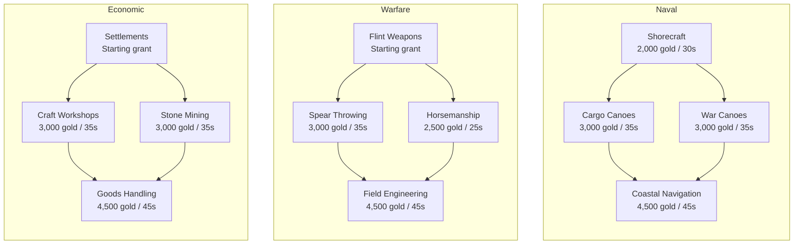
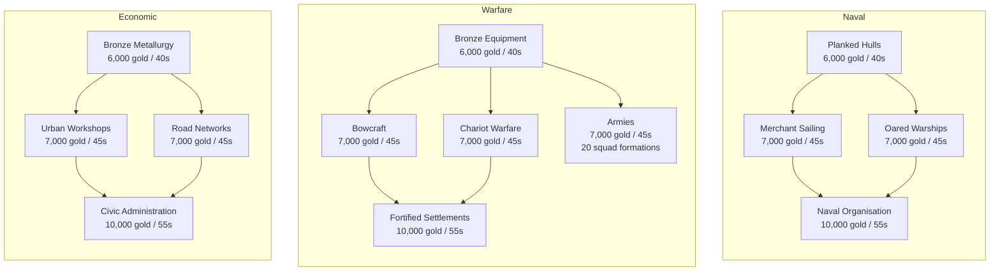
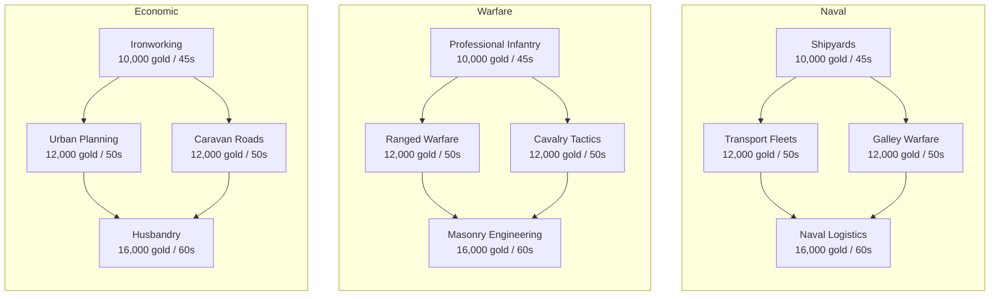
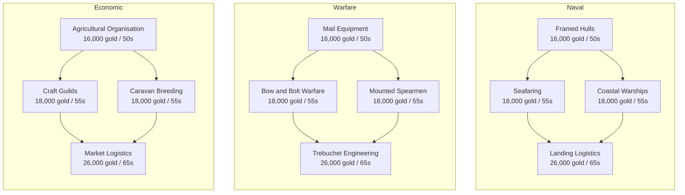
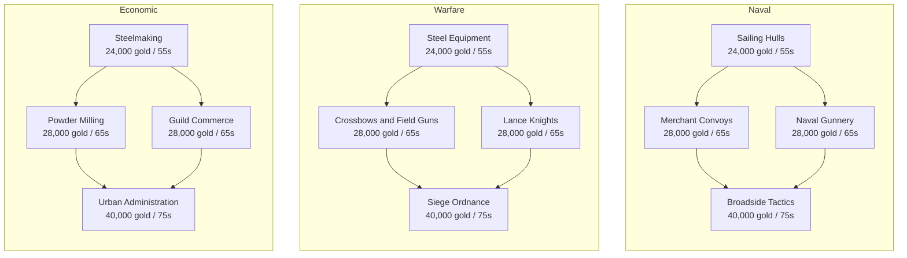
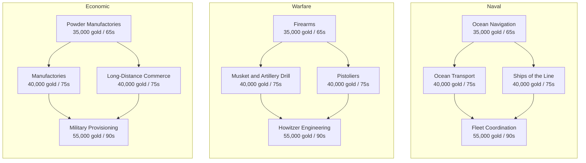
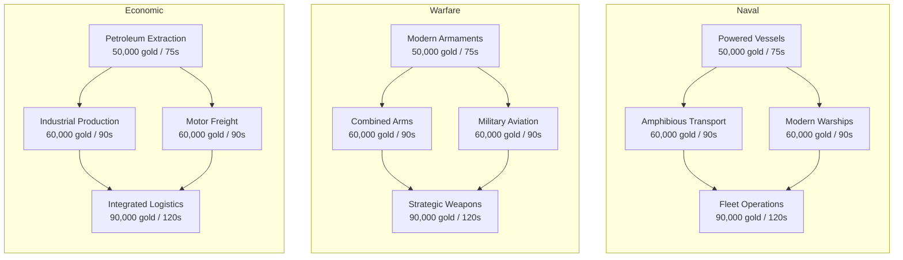

# Default culture: age-by-age technology map

Generated from [the complete base catalogue](base-tech-tree.md), September 30, 2026. All prices/timers are proposals. The tables in that catalogue are the source of truth; regenerate this map when content changes.

Each tree usually has a foundation, two independent branches and a final node requiring both. Bronze Warfare adds Armies as a fifth node branching from Bronze Equipment. Complete every node in any two current-age trees to qualify for the paid/timed age advance. Catch-up prerequisites stay in the same tree; every foundation after Stone also requires its empire age and previous tree completion. Classical Warfare requires both Fortified Settlements and Armies.

## Stone Age

Flint Weapons and Settlements are already completed. Start with three melee formations and no buildings.

After any two of these trees finish: advance to Bronze Age for 50,000 gold and the proposed 40 seconds.

## Bronze Age

Each foundation also requires Bronze Age empire age and the corresponding Stone Age final technology.

After any two of these trees finish: advance to Classical Age for 75,000 gold and the proposed 45 seconds.

## Classical Age

Each foundation also requires Classical Age empire age and the corresponding Bronze Age final technology. Professional Infantry additionally requires B-W5 Armies, so Warfare catch-up retains the whole five-node Bronze tree.

After any two of these trees finish: advance to Early Medieval for 110,000 gold and the proposed 50 seconds.

## Early Medieval

Each foundation also requires Early Medieval empire age and the corresponding Classical Age final technology.

After any two of these trees finish: advance to Late Medieval for 160,000 gold and the proposed 55 seconds.

## Late Medieval

Each foundation also requires Late Medieval empire age and the corresponding Early Medieval final technology.

After any two of these trees finish: advance to Early Modern for 230,000 gold and the proposed 60 seconds.

## Early Modern

Each foundation also requires Early Modern empire age and the corresponding Late Medieval final technology.

After any two of these trees finish: advance to Modern for 330,000 gold and the proposed 65 seconds.

## Modern

Each foundation also requires Modern empire age and the corresponding Early Modern final technology.

Modern has no further age or automatic victory. Combined Arms also grants gun nests/trenches and aircraft-only anti-air vehicles; existing walls remain usable. Strategic Weapons also grants fixed and mobile MIRV launchers. These are capability bundles within the existing nodes, not extra counted technologies. Missile defence is separate and its placement remains open. See [Modern rules](modern-defences-and-strategic-weapons.md). Ordinary victory follows the configured solo/allied mode.

## Cross-cutting rules

Promotions use combat XP and seven-level star overlays. Completed age refits reset promotion to recruit. Charge is a definition-specific ability, not extra counted research. Siege projectiles/bombs have separate Projectile Size and Blast Radius. See [combat rules](combat-and-promotions.md) and [art evidence](base-tech-tree-art-audit.md).
