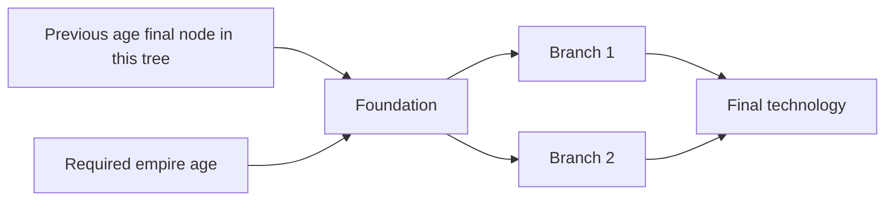

# Default culture: complete base technology tree

Design proposal, September 30, 2026. This is the full content draft for the first culture, not an implemented ruleset or a playtested balance result. All 85 counted technologies have a research placement, prerequisite, gold price, timer, and capability bundle. Bronze Armies is the user-confirmed fifth Warfare technology. Prices, timers other than the confirmed first advancement range, and numerical effects remain tuning proposals.

Policy: [technology and cultures](tech-tree-and-cultures.md). Evidence: [complete art audit](base-tech-tree-art-audit.md). Connected rules: [materials and weapons](strategic-resources.md), [combat and promotions](combat-and-promotions.md), [Modern defences and strategic weapons](modern-defences-and-strategic-weapons.md), [trade](trade-and-economy.md), [fortifications](fortifications-and-siege.md), [UI](ui-materials-and-technology.md), and [pacing](pacing-and-opening.md).

## Rules carried into this catalogue

- Seven ages, with Naval, Warfare, and Economic research in each. Usually four counted nodes: foundation, two independent branches, and a final technology requiring both branches. Bronze Warfare also has Armies as a fifth counted node.
- Research spends gold and takes simulation time. One queue per tree can run alongside the other two. Research does not require a material, weapon, building, coastline, or deposit merely to complete.
- Complete every counted node in any two **current-age** trees to become eligible for the paid, timed age advance. Bronze Warfare requires all five, including Armies; Bronze Naval/Economic still require four each. Older completion never substitutes for current-age completion. Modern has no further age transition.
- The default culture begins with Flint Weapons and Settlements completed. It starts with three melee formations, no buildings, and enough gold for a city and barracks. Starting grants do not spawn buildings.
- A new-age foundation requires that age and completion of the previous-age tree. In the usual four-node graph its final node proves that completion; Classical Warfare additionally requires Bronze Armies. Unfinished old trees remain available for catch-up. No research prerequisite crosses into another tree.
- Horses are available from Stone Horsemanship; Stone Mining remains independent. Basic gunpowder becomes available in Late Medieval for naval guns, with the new Organ Gun/Bombard art also placed in this tier; handheld infantry firearms and larger powder production arrive in Early Modern. Oil, aviation, and strategic weapons arrive in Modern.
- Every post-Stone land troop keeps its original manufactured-weapon requirement. Mounted formations additionally cost horses. Tanks require manufactured armament, steel, oil, and reserves, with no horse charge.
- Recruiting an older unlocked definition remains possible with that definition's weapons/reserves despite a shortage of newer metal. Research never upgrades an existing formation. The left-card Upgrade action resets a successfully refitted formation to recruit promotion level.
- Promotions come from combat damage, kills, and objectives. They use the existing seven-level star artwork. Maximum promotion stays slightly below next-age recruits of the corresponding branch under the combat benchmarks.
- Slow early manpower growth. City technology unlocks a paid per-city upgrade; existing cities do not improve automatically with research or empire age. Classical Urban Planning is the first substantial city growth breakpoint. See the [manpower plan](<optimization and ai improvement/manpower-and-city-upgrades.md>) for existing-node bindings and provisional rates. Medieval plagues are only under consideration.
- Armies initially hold 20 squad formations, with later capacity growth. Squad strength/capacity grows with its unit tier, not automatically with faction age. Larger squads primarily gain HP; full-squad attack power needs separate tuning, alongside armour and gunpowder accuracy. See [armies and squad sizes](<optimization and ai improvement/armies-formations-and-squad-sizes.md>).
- Every existing tower unlock includes automatic arrow attacks against hostile ground combat troops only, with its tier's authored range, damage, reload and legal firing policy. No extra research node is added. Retained older towers do not upgrade their weapons automatically; see [tower attacks](fortifications-and-siege.md#tower-arrow-attacks).

Node codes below are planning references. N/W/E identify Naval/Warfare/Economic; 1 is foundation, 2 and 3 are branches, and 4 is the usual final node. B-W5 is the additional Armies branch. Production definitions should use named, immutable technology IDs and separate progression-slot IDs; neither filenames nor these ordinal codes should become combat rules.

The two branches are independent; buying one does not unlock the other. A composite node grants several related definitions without introducing unlisted paid sub-technologies. Operational supply requirements appear later in this document; they are not research edges.

## Whole-tree overview

In each cell: foundation -> {branch 1, branch 2} -> final technology.

| Age            | Naval                                                                          | Warfare                                                                             | Economic                                                                                 |
| -------------- | ------------------------------------------------------------------------------ | ----------------------------------------------------------------------------------- | ---------------------------------------------------------------------------------------- |
| Stone          | Shorecraft -> {Cargo Canoes, War Canoes} -> Coastal Navigation                 | Flint Weapons -> {Spear Throwing, Horsemanship} -> Field Engineering                | Settlements -> {Craft Workshops, Stone Mining} -> Goods Handling                         |
| Bronze         | Planked Hulls -> {Merchant Sailing, Oared Warships} -> Naval Organisation      | Bronze Equipment -> {Bowcraft, Chariot Warfare} -> Fortified Settlements; additional Armies branch | Bronze Metallurgy -> {Urban Workshops, Road Networks} -> Civic Administration            |
| Classical      | Shipyards -> {Transport Fleets, Galley Warfare} -> Naval Logistics             | Professional Infantry -> {Ranged Warfare, Cavalry Tactics} -> Masonry Engineering   | Ironworking -> {Urban Planning, Caravan Roads} -> Husbandry                              |
| Early Medieval | Framed Hulls -> {Seafaring, Coastal Warships} -> Landing Logistics             | Mail Equipment -> {Bow and Bolt Warfare, Mounted Spearmen} -> Trebuchet Engineering | Agricultural Organisation -> {Craft Guilds, Caravan Breeding} -> Market Logistics        |
| Late Medieval  | Sailing Hulls -> {Merchant Convoys, Naval Gunnery} -> Broadside Tactics        | Steel Equipment -> {Crossbows and Field Guns, Lance Knights} -> Siege Ordnance      | Steelmaking -> {Powder Milling, Guild Commerce} -> Urban Administration                  |
| Early Modern   | Ocean Navigation -> {Ocean Transport, Ships of the Line} -> Fleet Coordination | Firearms -> {Musket and Artillery Drill, Pistoliers} -> Howitzer Engineering        | Powder Manufactories -> {Manufactories, Long-Distance Commerce} -> Military Provisioning |
| Modern         | Powered Vessels -> {Amphibious Transport, Modern Warships} -> Fleet Operations | Modern Armaments -> {Combined Arms, Military Aviation} -> Strategic Weapons         | Petroleum Extraction -> {Industrial Production, Motor Freight} -> Integrated Logistics   |

## Stone Age

S = Stone. War and economy foundations are free starting grants. Horsemanship is the cheapest and quickest paid resource access in the opening draft; the player is not forced to buy it before mining.

| Node | Technology         | Research prerequisite | Gold / time | Capability bundle                                                                                                                                                                                                              |
| ---- | ------------------ | --------------------- | ----------- | ------------------------------------------------------------------------------------------------------------------------------------------------------------------------------------------------------------------------------ |
| S-N1 | Shorecraft         | None                  | 2,000 / 30s | Construct Stone ports. Port access alone creates no military vessel, sea trader, or passive trade income.                                                                                                                      |
| S-N2 | Cargo Canoes       | S-N1                  | 3,000 / 35s | Stone troop transport definition; distinct Stone civilian trade vessel capability for factory/port dispatch. Both match the separate Transport and Trade art.                                                                  |
| S-N3 | War Canoes         | S-N1                  | 3,000 / 35s | Stone warship definition for local escort/interception. Keep its combat stats independent of the transport.                                                                                                                    |
| S-N4 | Coastal Navigation | S-N2 + S-N3           | 4,500 / 45s | Improve Stone sailing and embark/disembark handling under authored values; complete Naval. Does not bypass coast/reachability rules.                                                                                           |
| S-W1 | Flint Weapons      | Starting grant        | 0 / 0s      | Stone barracks and clubmen/Flint infantry. No manufactured-weapon requirement.                                                                                                                                                 |
| S-W2 | Spear Throwing     | S-W1                  | 3,000 / 35s | Stone ranged camp and javelinists. Ranged damage, range, and reload define this role. No manufactured weapons.                                                                                                                 |
| S-W3 | Horsemanship       | S-W1                  | 2,500 / 25s | Horse-node exploitation, slow stable breeding, Stone stables and mounted spearmen. Recruitment costs reserves and horses. Proposed first charge-capable definition.                                                            |
| S-W4 | Field Engineering  | S-W2 + S-W3           | 4,500 / 45s | Wooden towers and linked palisades use Art/Terrain/Wall Kit/Palisades; gate capability, Stone field-siege production and battering ram. Siege breaches independently of infantry. Gate and Stone siege art remain outstanding. |
| S-E1 | Settlements        | Starting grant        | 0 / 0s      | Stone cities and their reserve-production capability. No free city appears at match start.                                                                                                                                     |
| S-E2 | Craft Workshops    | S-E1                  | 3,000 / 35s | Stone workshop/factory commercial production and bounded, automatically generated free land traders. Stone land-trader art is missing; the feature remains in this age.                                                        |
| S-E3 | Stone Mining       | S-E1                  | 3,000 / 35s | Stone mine construction and stone extraction. No Horsemanship prerequisite; Stone mine art is missing.                                                                                                                         |
| S-E4 | Goods Handling     | S-E2 + S-E3           | 4,500 / 45s | Finite multi-stop factory loads, improved handling, and the first cargo-capacity upgrade. Deliveries pay only at cities/ports.                                                                                                 |

Opening research can operate without an existing building. Opening construction and initial gold income must still satisfy the bootstrap budget in the pacing plan. Do not require stone for the first mine, city, or barracks before the player can acquire it.

## Bronze Age

B = Bronze. Every foundation also requires Bronze empire age.

| Node | Technology            | Research prerequisite | Gold / time  | Capability bundle                                                                                                                                                                                                                                              |
| ---- | --------------------- | --------------------- | ------------ | -------------------------------------------------------------------------------------------------------------------------------------------------------------------------------------------------------------------------------------------------------------- |
| B-N1 | Planked Hulls         | Bronze age + S-N4     | 6,000 / 40s  | Bronze port/shipbuilding tier and Bronze military transport definition. Enables the new hull tier; does not refit old ships automatically.                                                                                                                     |
| B-N2 | Merchant Sailing      | B-N1                  | 7,000 / 45s  | Bronze trade-ship definition and sailing/cargo capability. Dispatch remains automatic, free, bounded, and dependent on real factory cargo.                                                                                                                     |
| B-N3 | Oared Warships        | B-N1                  | 7,000 / 45s  | Bronze oared warship definition, using the galley-like art. Escort and interception are baseline military uses.                                                                                                                                                |
| B-N4 | Naval Organisation    | B-N2 + B-N3           | 10,000 / 55s | Better loading/transport capacity and coordinated naval handling. No sharing of allied units or inventory is implied.                                                                                                                                          |
| B-W1 | Bronze Equipment      | Bronze age + S-W4     | 6,000 / 40s  | Bronze blacksmith, barracks tier, bronze melee-kit pattern, and bronze swordsmen. Materials -> finished weapons -> recruitment.                                                                                                                                |
| B-W2 | Bowcraft              | B-W1                  | 7,000 / 45s  | Bronze archery range/archers and their own ranged-kit pattern.                                                                                                                                                                                                 |
| B-W3 | Chariot Warfare       | B-W1                  | 7,000 / 45s  | Bronze stable tier and two-horse chariot definition, matching the animated art. Chariot armament plus horses and reserves; proposed charge capability.                                                                                                         |
| B-W4 | Fortified Settlements | B-W2 + B-W3           | 10,000 / 55s | Stone walls and round stone towers use Art/Terrain/Wall Kit/StoneWalls; gate capability, Bronze siege workshop, reinforced ram and siege-equipment pattern. Battering-ram and assault siege-tower art exists; assault/bridge behaviour needs its own contract. |
| B-W5 | Armies                | B-W1                  | 7,000 / 45s  | Persistent armies of up to 20 squad formations, selectable army icon, cohesive marching columns at roughly 110% of the slowest member's ordinary eligible speed, role-based deployment, manual tactics and an automatic-tactics toggle. No free troops, refits or promotion. |
| B-E1 | Bronze Metallurgy     | Bronze age + S-E4     | 6,000 / 40s  | Additional raw mining and alloy refining to bronze; Bronze mine/factory processing tier. Bronze is manufactured, not a deposit.                                                                                                                                |
| B-E2 | Urban Workshops       | B-E1                  | 7,000 / 45s  | Bronze city/commercial workshop tier, handcart merchant definition, and improved commercial output.                                                                                                                                                            |
| B-E3 | Road Networks         | B-E1                  | 7,000 / 45s  | Packed-dirt trade-road tier and researched route movement/handling improvement. Physical road authoring/placement policy remains open.                                                                                                                         |
| B-E4 | Civic Administration  | B-E2 + B-E3           | 10,000 / 55s | Higher delivery capacity and city reserve administration. No separate market/town-hall building is required.                                                                                                                                                   |

The cavalry image contains chariots, not an ordinary mounted rider reskin. Horse quantities are formation recipes, not inferred automatically from the eight animals in its artwork.

Armies is a separate fifth technology, not a replacement for Bowcraft or Fortified Settlements. Its B-W1 prerequisite and 7,000/45s quote are proposals. Research can complete without recruiting 20 units. All five Bronze Warfare nodes count toward tree completion. Classical Warfare must retain both B-W4 and B-W5 as catch-up requirements; reaching Classical through Naval/Economic does not grant Armies. Later Warfare foundations are proposed homes for army-cap increases, with no additional paid nodes. Exact caps and their effects are in the army plan.

## Classical Age

C = Classical. Every foundation also requires Classical empire age.

| Node | Technology            | Research prerequisite | Gold / time  | Capability bundle                                                                                                                                                                                          |
| ---- | --------------------- | --------------------- | ------------ | ---------------------------------------------------------------------------------------------------------------------------------------------------------------------------------------------------------- |
| C-N1 | Shipyards             | Classical age + B-N4  | 10,000 / 45s | Classical port and hull-production tier. No extra standalone shipyard art/building is assumed.                                                                                                             |
| C-N2 | Transport Fleets      | C-N1                  | 12,000 / 50s | Classical transport and trade-ship definitions, with larger authored troop/cargo capacity.                                                                                                                 |
| C-N3 | Galley Warfare        | C-N1                  | 12,000 / 50s | Classical galley warship definition; combat/escort capability appropriate to its oared art.                                                                                                                |
| C-N4 | Naval Logistics       | C-N2 + C-N3           | 16,000 / 60s | Improved naval load handling and delivery turnaround; maintain cargo conservation and actual arrival payments.                                                                                             |
| C-W1 | Professional Infantry | Classical age + B-W4 + B-W5 | 10,000 / 45s | Classical blacksmith/barracks, iron infantry-kit pattern, sword-and-shield infantry, and improved protection; proposed Classical army-cap increase. |
| C-W2 | Ranged Warfare        | C-W1                  | 12,000 / 50s | Classical archers/ranged kits plus Mangonel field-artillery equipment and training at the Classical siege-yard capability. Distinct projectile/range/reload profiles.                                      |
| C-W3 | Cavalry Tactics       | C-W1                  | 12,000 / 50s | Classical stables and mounted swordsmen, mounted kit plus horses; proposed charge profile.                                                                                                                 |
| C-W4 | Masonry Engineering   | C-W2 + C-W3           | 16,000 / 60s | Massive stone walls and square bastions use Art/Terrain/Wall Kit/MassiveStoneWalls; gate capability, Classical siege facility and heavy Onager equipment/definition, distinct from Mangonel field support. |
| C-E1 | Ironworking           | Classical age + B-E4  | 10,000 / 45s | Iron-ore extraction and iron refining; Classical mine/factory processing tier.                                                                                                                             |
| C-E2 | Urban Planning        | C-E1                  | 12,000 / 50s | Classical city/workshop tier and improved commercial production/urban reserves.                                                                                                                            |
| C-E3 | Caravan Roads         | C-E1                  | 12,000 / 50s | Compacted-gravel road tier and Classical merchant party: mule wagon plus pack donkey. Larger finite load and researched route efficiency.                                                                  |
| C-E4 | Husbandry             | C-E2 + C-E3           | 16,000 / 60s | Improved horse breeding at eligible owned stables and better logistical handling. Research can complete without owning a stable.                                                                           |

Classical recruitment does not retire Bronze definitions or recipes. Bronze weapons in storage remain usable even with no iron stock.

## Early Medieval

EMed = Early Medieval. Every foundation also requires Early Medieval empire age. This remains an iron-based stage; do not invent a new compulsory metal merely to make the age distinct.

| Node    | Technology                | Research prerequisite     | Gold / time  | Capability bundle                                                                                                                                                                                     |
| ------- | ------------------------- | ------------------------- | ------------ | ----------------------------------------------------------------------------------------------------------------------------------------------------------------------------------------------------- |
| EMed-N1 | Framed Hulls              | Early Medieval age + C-N4 | 16,000 / 50s | Early Medieval port and stronger hull-production tier.                                                                                                                                                |
| EMed-N2 | Seafaring                 | EMed-N1                   | 18,000 / 55s | Early Medieval transport/trade ships and improved sailing performance.                                                                                                                                |
| EMed-N3 | Coastal Warships          | EMed-N1                   | 18,000 / 55s | Early Medieval oared/sailing warship definition. Raiding is a use of military orders, not a new automatic gold generator.                                                                             |
| EMed-N4 | Landing Logistics         | EMed-N2 + EMed-N3         | 26,000 / 65s | More efficient legal landing/embarkation and naval cargo handling.                                                                                                                                    |
| EMed-W1 | Mail Equipment            | Early Medieval age + C-W4 | 16,000 / 50s | Early Medieval blacksmith/barracks and mail/iron infantry-kit pattern; sword-and-shield infantry.                                                                                                     |
| EMed-W2 | Bow and Bolt Warfare      | EMed-W1                   | 18,000 / 55s | Early Medieval bowmen/ranged kits plus Ballista field-artillery equipment and training at the era siege-yard capability.                                                                              |
| EMed-W3 | Mounted Spearmen          | EMed-W1                   | 18,000 / 55s | Early Medieval stables/mounted spearmen, mounted-kit pattern and horses; proposed stronger charge profile.                                                                                            |
| EMed-W4 | Trebuchet Engineering     | EMed-W2 + EMed-W3         | 26,000 / 65s | Improved masonry walls/towers/gates, Early Medieval siege workshop and Trebuchet equipment/definition. The current wall kit ends at Classical; a distinct Early Medieval visual tier is not verified. |
| EMed-E1 | Agricultural Organisation | Early Medieval age + C-E4 | 16,000 / 50s | Early Medieval city/mine operating tier, improved reserve generation and extraction efficiency. No separate farm building is implied by this technology name.                                         |
| EMed-E2 | Craft Guilds              | EMed-E1                   | 18,000 / 55s | Early Medieval workshop/factory tier and higher commercial/refining production efficiency through separate jobs.                                                                                      |
| EMed-E3 | Caravan Breeding          | EMed-E1                   | 18,000 / 55s | Two-wagon horse caravan, rough-stone roads, and another stable breeding improvement. Commercial mounts do not charge the military horse inventory.                                                    |
| EMed-E4 | Market Logistics          | EMed-E2 + EMed-E3         | 26,000 / 65s | Larger funded multi-stop loads and shorter handling delays; improve throughput before increasing actor caps.                                                                                          |

## Late Medieval

LMed = Late Medieval. Every foundation also requires Late Medieval empire age. The confirmed early naval-powder decision matches the existing cannon-broadside warship animation; handheld infantry firearms still begin in Early Modern.

| Node    | Technology               | Research prerequisite       | Gold / time  | Capability bundle                                                                                                                                                                                                  |
| ------- | ------------------------ | --------------------------- | ------------ | ------------------------------------------------------------------------------------------------------------------------------------------------------------------------------------------------------------------ |
| LMed-N1 | Sailing Hulls            | Late Medieval age + EMed-N4 | 24,000 / 55s | Late Medieval port and sailing-hull production tier.                                                                                                                                                               |
| LMed-N2 | Merchant Convoys         | LMed-N1                     | 28,000 / 65s | Late Medieval transport/trade-ship definitions and expanded maritime capacity. Escort remains a military assignment, not automatic immunity.                                                                       |
| LMed-N3 | Naval Gunnery            | LMed-N1                     | 28,000 / 65s | Cannon-armed Late Medieval warship and naval-ordnance capability. Powder supply is an operational input question, not an Economic research prerequisite.                                                           |
| LMed-N4 | Broadside Tactics        | LMed-N2 + LMed-N3           | 40,000 / 75s | Improved naval gunnery/reload and formation handling. Port/starboard art supports a proposed broadside profile; firing arcs must be domain-defined.                                                                |
| LMed-W1 | Steel Equipment          | Late Medieval age + EMed-W4 | 24,000 / 55s | Late Medieval blacksmith/barracks, steel infantry kits and plate swordsmen.                                                                                                                                        |
| LMed-W2 | Crossbows and Field Guns | LMed-W1                     | 28,000 / 65s | Crossbowmen/crossbow kits plus Organ Gun field-artillery equipment and siege-yard training. Different reload/penetration/volley profiles; the Organ Gun operates on early powder supply.                           |
| LMed-W3 | Lance Knights            | LMed-W1                     | 28,000 / 65s | Knight stables, knight equipment and lance cavalry costing horses; strongest proposed traditional mounted charge.                                                                                                  |
| LMed-W4 | Siege Ordnance           | LMed-W2 + LMed-W3           | 40,000 / 75s | Stronger towers/walls/gates, Late Medieval siege workshop and Bombard equipment/definition. Powder supply supports siege/field guns as well as naval guns; handheld firearm infantry still starts in Early Modern. |
| LMed-E1 | Steelmaking              | Late Medieval age + EMed-E4 | 24,000 / 55s | Carbon/fuel raw extraction as authored, steel refining, and Late Medieval mine/factory tier. No mineable steel deposit.                                                                                            |
| LMed-E2 | Powder Milling           | LMed-E1                     | 28,000 / 65s | Basic gunpowder ingredient extraction/processing for early naval guns and the proposed Organ Gun/Bombard equipment. No handheld firearm infantry is granted here.                                                  |
| LMed-E3 | Guild Commerce           | LMed-E1                     | 28,000 / 65s | Late Medieval city/commercial production tier, three covered-wagon trader, and cobblestone roads.                                                                                                                  |
| LMed-E4 | Urban Administration     | LMed-E2 + LMed-E3           | 40,000 / 75s | Higher commercial load capacity, reserve administration, and producer handling efficiency.                                                                                                                         |

Researching Naval Gunnery without Economic powder access remains legal. Whether ship construction consumes powder/finished naval armament, and whether imported/captured strategic stocks exist, needs an explicit operational recipe before implementation.

## Early Modern

EMod = Early Modern. Every foundation also requires Early Modern empire age.

| Node    | Technology                 | Research prerequisite      | Gold / time  | Capability bundle                                                                                                                                                                           |
| ------- | -------------------------- | -------------------------- | ------------ | ------------------------------------------------------------------------------------------------------------------------------------------------------------------------------------------- |
| EMod-N1 | Ocean Navigation           | Early Modern age + LMed-N4 | 35,000 / 65s | Early Modern port/hull tier and improved maritime navigation performance; no arbitrary global teleportation.                                                                                |
| EMod-N2 | Ocean Transport            | EMod-N1                    | 40,000 / 75s | Early Modern ocean transport and merchant-ship definitions, larger legal load capacity.                                                                                                     |
| EMod-N3 | Ships of the Line          | EMod-N1                    | 40,000 / 75s | Early Modern gun warship definition and its gunnery capability.                                                                                                                             |
| EMod-N4 | Fleet Coordination         | EMod-N2 + EMod-N3          | 55,000 / 90s | Better fleet handling, loading and gunnery coordination under explicit combat values.                                                                                                       |
| EMod-W1 | Firearms                   | Early Modern age + LMed-W4 | 35,000 / 65s | Firearm-producing Armory, Early Modern barracks, short-gun infantry and firearm-kit pattern. The former Melee art category now represents frontline ranged fire.                            |
| EMod-W2 | Musket and Artillery Drill | EMod-W1                    | 40,000 / 75s | Musketeers with longer-range firearm kit plus field cannon equipment/training, using the NapoleonicCannon_EarlyModern art. Distinct musket and artillery attack profiles.                   |
| EMod-W3 | Pistoliers                 | EMod-W1                    | 40,000 / 75s | Early Modern stables and mounted pistoliers; pistol kit plus horses/reserves. A mounted firearm role does not automatically inherit melee charge.                                           |
| EMod-W4 | Howitzer Engineering       | EMod-W2 + EMod-W3          | 55,000 / 90s | Gunpowder-era fortifications, Early Modern siege foundry and Early Howitzer equipment/definition, separate from the field cannon. Keep material/weapon requirements separate from research. |
| EMod-E1 | Powder Manufactories       | Early Modern age + LMed-E4 | 35,000 / 65s | Higher-volume powder/refining recipes and Early Modern mine/factory tier; builds on Late Medieval powder capability.                                                                        |
| EMod-E2 | Manufactories              | EMod-E1                    | 40,000 / 75s | Early Modern city/commercial factory tier and improved production throughput. Shared infrastructure still separates commercial batches and strategic jobs.                                  |
| EMod-E3 | Long-Distance Commerce     | EMod-E1                    | 40,000 / 75s | Four-wagon trader, dressed-stone roads, and improved finite route capacity/handling. Foreign/allied commerce already exists and is not gated here.                                          |
| EMod-E4 | Military Provisioning      | EMod-E2 + EMod-E3          | 55,000 / 90s | Better equipment-production handling and stable breeding/logistics; larger supported deliveries without unbounded free trader creation.                                                     |

## Modern

M = Modern. Every foundation also requires Modern empire age. Aviation and strategic weapons are included in this culture's counted Warfare content, not placed in an eighth age or hidden extra tree.

| Node | Technology            | Research prerequisite | Gold / time   | Capability bundle                                                                                                                                                                                                                                                                                                                                                   |
| ---- | --------------------- | --------------------- | ------------- | ------------------------------------------------------------------------------------------------------------------------------------------------------------------------------------------------------------------------------------------------------------------------------------------------------------------------------------------------------------------- |
| M-N1 | Powered Vessels       | Modern age + EMod-N4  | 50,000 / 75s  | Modern port and powered hull-production tier. Fuel/ship recipes require separate authoring.                                                                                                                                                                                                                                                                         |
| M-N2 | Amphibious Transport  | M-N1                  | 60,000 / 90s  | Modern transport and container trade ship; authored transport capacity for heavier definitions such as tanks. No aircraft-carrier mechanics are inferred.                                                                                                                                                                                                           |
| M-N3 | Modern Warships       | M-N1                  | 60,000 / 90s  | Modern warship and naval gunnery; map its actual art to a combat definition rather than simply boosting a canoe's DPS.                                                                                                                                                                                                                                              |
| M-N4 | Fleet Operations      | M-N2 + M-N3           | 90,000 / 120s | Final naval handling/capacity/combat coordination tier. Sensors/anti-air behaviour require explicit combat/visibility contracts before being advertised.                                                                                                                                                                                                            |
| M-W1 | Modern Armaments      | Modern age + EMod-W4  | 50,000 / 75s  | Arms Factory, Modern barracks, rifle infantry and rifle-kit pattern. Older researched equipment recipes remain available.                                                                                                                                                                                                                                           |
| M-W2 | Combined Arms         | M-W1                  | 60,000 / 90s  | Marksmen, machine-gun crews, tanks, vehicle depot and towed howitzer; gun nests and trenches replace the new Modern wall tier; aircraft-only anti-air vehicles and their equipment pattern. Existing walls remain usable without conversion. Tanks cost armament + steel + oil + reserves; other vehicle recipes need authoring.                                    |
| M-W3 | Military Aviation     | M-W1                  | 60,000 / 90s  | Military Airstrip, fighters, bombers, aircraft-armament patterns and conventional aerial-bomb payload capability. Aircraft combat, airfield capacity, sorties and interception need authored rules.                                                                                                                                                                 |
| M-W4 | Strategic Weapons     | M-W2 + M-W3           | 90,000 / 120s | Missile Silo/ICBM, hydrogen-bomb payload, dedicated fixed MIRV launcher building and mobile MIRV launcher vehicle; manufactured launcher-equipment and MIRV carrier/multiple-warhead payload patterns. Launcher, payload and launch are distinct definitions/jobs. Missile defence remains separate; production, targeting, flight and damage rules need authoring. |
| M-E1 | Petroleum Extraction  | Modern age + EMod-E4  | 50,000 / 75s  | Oil deposits and late offshore Oil Rigs. Proposed onshore extraction uses the existing Oil Well art under this same node; placement/ownership must be explicit.                                                                                                                                                                                                     |
| M-E2 | Industrial Production | M-E1                  | 60,000 / 90s  | Modern city/factory/mine tier, higher existing-material refining/commercial output, and improved production throughput. No new obligatory metal.                                                                                                                                                                                                                    |
| M-E3 | Motor Freight         | M-E1                  | 60,000 / 90s  | Modern civilian freight-truck trader and asphalt roads with larger finite load. Free factory dispatch does not silently deduct horses, oil or a military weapon kit.                                                                                                                                                                                                |
| M-E4 | Integrated Logistics  | M-E2 + M-E3           | 90,000 / 120s | Highest proposed production/load-handling tier and final horse-breeding improvement on retained eligible horse stables. Modern vehicle-depot art is not a new horse-breeding building.                                                                                                                                                                              |

There is no Advance Age action after Modern. Completing two trees here is a progress milestone, not a free win condition; solo/allied victory still follows the separate configured mode.

Modern Warfare bundles more capabilities than earlier tiers, now including gun nests, trenches, anti-air vehicles and fixed/mobile MIRV launchers. Four nodes keep the counted research workload comparable, but each node must expose its full contents; unit/building/payload production is separately priced and timed. Existing walls remain usable after Modern advancement and do not automatically convert. If aviation/strategic combat proves too large for this bundle, revise counted slot structure and pacing openly rather than adding unlisted mandatory research.

## Actual units, equipment, and production lines

These are proposed authored equipment categories, not quantities or finished icon assets. Each combat formation is a game entity; five illustrated soldiers do not set the reserve or equipment-token price.

| Age            | Frontline branch          | Ranged branch     | Mobile branch      | Proposed equipment producer                                                                                  | Siege / field support                                     |
| -------------- | ------------------------- | ----------------- | ------------------ | ------------------------------------------------------------------------------------------------------------ | --------------------------------------------------------- |
| Stone          | Clubmen / Flint infantry  | Javelinists       | Mounted spearmen   | No manufactured weapons for Stone troops                                                                     | Field ram (art needed)                                    |
| Bronze         | Bronze swordsmen          | Bronze archers    | Two-horse chariots | Bronze blacksmith: distinct melee, ranged, chariot, siege kits                                               | Battering ram; assault siege tower                        |
| Classical      | Sword-and-shield infantry | Classical archers | Mounted swordsmen  | Classical blacksmith: corresponding iron-based kits                                                          | Mangonel field support; Onager siege                      |
| Early Medieval | Mail infantry             | Bowmen            | Mounted spearmen   | Early Medieval blacksmith: corresponding iron-based kits                                                     | Ballista field support; Trebuchet siege                   |
| Late Medieval  | Plate swordsmen           | Crossbowmen       | Lance knights      | Late Medieval blacksmith: steel melee/crossbow/knight/siege kits                                             | Organ Gun field support; Bombard siege                    |
| Early Modern   | Short-gun infantry        | Musketeers        | Mounted pistoliers | Armory: firearm/musket/pistol/cannon equipment; older smith patterns retained                                | Field cannon; Early Howitzer siege                        |
| Modern         | Rifle infantry            | Marksmen          | Tanks              | Arms Factory: rifle/marksman/tank/anti-air/mobile-launcher/artillery/aircraft armament and authored payloads | Machine-gun crew; Modern Howitzer siege; anti-air support |

Field-artillery training is bundled into the ranged branch from Classical onward, using the era siege-yard producer capability; the final Warfare node adds the dedicated siege definition and fortification tier. This avoids an unavailable field-artillery building or a hidden prerequisite. Machine-gun crews are support against troops, not an automatic wall-breaching upgrade. The Bronze siege tower is an assault-support definition with its own interaction policy, not a fixed defence tower.

Weapon patterns unlock with the owning combat technology. Extraction/refining unlocks live in Economic. Producer compatibility is capability-based: an upgraded producer can retain compatible older patterns, but a blacksmith cannot magically fabricate modern strategic payloads.

The artwork's Melee/Ranged/Cavalry folder names are presentation categories, not guaranteed attack types. Early Modern frontline troops and Modern rifle infantry have ranged attacks. Chariots, mounted spearmen, pistoliers and tanks need separate movement/attack/target/charge definitions. Tanks are not cavalry with horses set to zero.

Siege-shot and bomb definitions carry separate Projectile Size and Blast Radius, as confirmed. Rams remain contact weapons with no fabricated projectile. Projectile collision, impact damage and blast falloff are domain properties; sprite pixels, explosion-frame duration and camera zoom do not determine them. See the projectile contract in the combat plan.

Manufactured kits feed the selected original-age troop recipe. Do not deduct the same bronze/iron/steel again at recruitment after it was already consumed to manufacture the kit, unless the recruitment recipe separately names a structural input. Tanks explicitly add structural steel and oil to their manufactured-armament cost, as confirmed.

Post-Stone siege is proposed to use manufactured siege equipment; Stone siege follows the Stone troop exemption. Naval weapon/fuel costs, aircraft chassis/fuel quantities, ongoing ammunition, and strategic-payload recipes remain separate content decisions. This catalogue grants capabilities without inventing a physical military delivery network or additional raw uranium/resource chain.

## Horse, cargo, and road development

| Stage          | Horse progression                                          | Commercial presentation                      | Proposed land delivery-stop budget |
| -------------- | ---------------------------------------------------------- | -------------------------------------------- | ---------------------------------- |
| Stone          | Horsemanship opens nodes and slow stable breeding          | Stone carrier/trader art needed              | 2                                  |
| Bronze         | Retain contested nodes and basic stable production         | Handcart merchant; packed dirt               | 3                                  |
| Classical      | Husbandry improves domestic breeding                       | Mule wagon and pack donkey; compacted gravel | 4                                  |
| Early Medieval | Caravan Breeding improves stable output                    | Two horse wagons; rough stone                | 5                                  |
| Late Medieval  | Existing breeding plus better handling; nodes still useful | Three covered wagons; cobblestones           | 6                                  |
| Early Modern   | Military Provisioning improves breeding/handling           | Four covered wagons; dressed stone           | 8                                  |
| Modern         | Integrated Logistics improves retained horse stables       | Civilian freight truck; asphalt              | 12                                 |

Stop values are proposed route ceilings, achievable only when finite loaded cargo funds those drops and valid distinct destinations are reachable. They are not automatic stops, invented cargo, or payout multipliers. Naval capacity has its own recipe/handling tuning. Research effects replace an authored tier value or compose under an explicit stacking policy; never compound the same upgrade repeatedly on capture/refit.

Breeding-rate targets should rise monotonically from the first stable to the final upgrade; exact horse/minute values must be balanced against formation horse costs. Commercial horses/donkeys depicted in trader art are presentation, not a military-horse recruitment fee. The Modern truck does not turn automatic free traders into paid tank recruitment.

Road art is cardinal-only, with all 16 connection masks authored for six ages. Do not rotate these into unprovided diagonal paths. Whether roads are placed, generated from routes, or upgraded explicitly remains unresolved; route art cannot silently alter authoritative movement.

## Research and one-hour gold budget

Proposed prices and durations are fully assigned above so they can be measured together. Age-transition fees/timers retain the existing proposal. Arrival targets include the advance timer; they do not add it afterwards.

| Research age   | Standard full tree                                         | Starting-grant adjustment         | Minimum two-tree research spend | Fee to next age | Target next-age arrival   |
| -------------- | ---------------------------------------------------------- | --------------------------------- | ------------------------------- | --------------- | ------------------------- |
| Stone          | Naval 12,500; Warfare 10,000; Economic 10,500 after grants | Warfare/Economic foundations free | 20,500                          | 50,000 / 40s    | Bronze ~7m                |
| Bronze         | Naval/Economic 30,000; Warfare 37,000                        | None                              | 60,000 via Naval/Economic; 67,000 with Warfare | 75,000 / 45s | Classical ~15m |
| Classical      | 50,000 per tree                                            | None                              | 100,000                         | 110,000 / 50s   | Early Medieval ~23m       |
| Early Medieval | 78,000 per tree                                            | None                              | 156,000                         | 160,000 / 55s   | Late Medieval ~32m        |
| Late Medieval  | 120,000 per tree                                           | None                              | 240,000                         | 230,000 / 60s   | Early Modern ~42m         |
| Early Modern   | 170,000 per tree                                           | None                              | 340,000                         | 330,000 / 65s   | Modern ~52m               |
| Modern         | 260,000 per tree                                           | None                              | No further advancement          | None            | Full content/endgame ~60m |

Minimum two-tree progression through the first six ages costs **916,500 research gold + 955,000 advancement gold = 1,871,500** when Bronze uses Naval/Economic, excluding every building/refit/operational expense and optional third-tree research. Choosing Warfare in Bronze adds 7,000. Researching all 85 nodes with the two grants costs **2,164,000**, plus advancement = **3,119,000 gold** before those expenses. These are budget totals, not promised earnings.

With ideal three-tree concurrency, no gold shortage, all prerequisite chains available, and no interruption, complete research through all seven ages plus the six advances retains a timer floor of **33m05s** under this catalogue. Stone Warfare/Economic finish at 105/115 seconds, allowing the 40-second advance to begin while Stone Naval finishes at 145 seconds; Bronze starts at 155 seconds. Bronze Naval/Economic take 185 seconds, while five-node Warfare takes 230. The 45-second Classical advance can overlap Armies research after the other two finish, so all Bronze trees finish by Classical arrival. This overlap is included in the arithmetic. Selecting Warfare for Bronze eligibility instead delays that advance by 45 seconds with these quotes. The hour target depends on gold acquisition, construction, fighting and supply, rather than a compulsory hour of idle research. Measure both minimum progression and full completion.

For the minimum two-tree path, research-plus-advance savings require roughly 168, 281, 438, 585, 783 and 1,117 net gold/second across the six target age intervals. Full three-tree completion raises those budgets. The last eight minutes need up to 780,000 gold for all Modern research (~1,625/second), plus any skipped old trees and combat spending. Rebalance delivered income and expenses coherently; the prototype's 20-gold/second factory cannot finance this tree unchanged.

## Progression risks and required decisions

**Research independence is not economic independence.** A Naval/Warfare player can advance legally without completing Economic, but new resource-dependent troops may be unavailable because extraction/refining is still in Economic. Retained Stone/older troop recipes provide fallback only while their required stock is available. Commercial foreign/allied bonuses do not import weapons or metals. Before calling all three advancement paths equally viable, measure this dependency and decide whether partial Economic investment, capture supply, or a separately authored material-import system is intended. Do not silently grant metal access on advancement or merge strategic stock into trader cargo.

**Strategic weapons need practical counterplay.** Modern includes fixed and mobile MIRV launchers as well as ICBM/hydrogen capabilities. Anti-air vehicles target aircraft only; missile defence is a separate capability whose placement and rules still need authoring. Unlocking these strategic weapons is confirmed; their production costs, warning/flight, interceptability, friendly-fire/alliance treatment, territory/structure effects, cooldowns and victory interaction are not. An unavoidable cheap strike that erases a developed empire would undermine the hour-long progression. Recommend substantial conserved payload production and readable response time; author combat rules before shipping the unlock as usable.

**Promotion is distinct from technology.** Recruitment starts at level 1, experience advances toward level 7, and completed age refits reset to level 1. Do not use the seven rank icons as empire-age badges. Benchmark a maximally promoted older formation against next-age recruits before treating the promotion ceiling as achieved.

**Art is not an additional tech.** Generic formation markers, star overlays, terrain accents, and explosion variants are presentation. A gunship-named impact does not prove a helicopter/gunship unit; the current aircraft art is fighter/bomber. Missing sprites do not justify deleting required Stone mining/siege/trade.

Still to author: exact combat values and charge roster, recipe quantities, building/refit costs and jobs, raw inputs/yields, strategic/naval/air combat contracts, producer logistics, road placement, queue cancellation/refunds, commercial launch/transfer rules, and AI purchase/order policy. Those gaps are explicit implementation gates, not omitted base-tree nodes.

## Static acceptance before implementation

- Exactly 85 counted nodes: 7 ages x 3 trees x 4, plus Bronze Armies; two valid free starting grants and 83 paid nodes. Bronze Warfare completion is 5/5; every other tree is 4/4.
- Unique references; every prerequisite resolves; no cycle or cross-tree research dependency; legal same-tree catch-up chains.
- Each of the three two-tree combinations can satisfy advancement at every nonfinal age using gold-only research; operational material constraints reported separately.
- Every authored age has frontline/ranged/mobile development, commerce, naval definitions, fortifications and a siege answer. New field-artillery and siege-unit families are explicitly placed from Classical/Bronze onward; Modern additionally has aviation and strategic weapons.
- Existing art families either map to a capability/presentation role or are explicitly parked as non-gameplay/unfinished evidence. No runtime discovery by folder name.
- Costs and timers sum to the budget above; Modern has no eighth-age fee; research and advance use simulation time.
- Promotion/charge policies remain in combat definitions; research does not add XP, silently refit formations, spend a commercial mount, or waive an older equipment recipe.

These catalogue checks are static planning checks. They do not establish combat quality, engine integration, asset readiness, or one-hour playtest balance.
