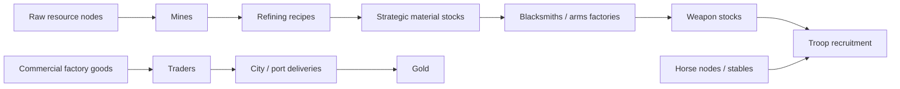

# Strategic resources, horses, and weapon production

Status: design draft. Updated September 30, 2026.

Related plans: [technology](tech-tree-and-cultures.md), [trade](trade-and-economy.md), [fortifications](fortifications-and-siege.md), and [pacing/opening](pacing-and-opening.md).

## Confirmed direction

- Horses are the first strategic resource to introduce/unlock.
- Early cavalry supply depends strongly on finding and capturing horse nodes.
- Stables generate horses slowly early and faster through later technology.
- Mounted cavalry costs horses.
- Add stone, bronze, iron, steel, gunpowder, and oil to strategic development.
- Unlock mines early. Initially they extract stone; extracting additional materials needs research.
- Mines extract raw materials; factories process manufactured materials such as bronze, steel, and gunpowder.
- Oil extraction uses late-game rigs.
- Blacksmiths and arms factories consume strategic materials and produce weapons required to create troops.
- Strategic materials and weapon production are separate from commercial trader cargo.
- Allied players initially retain independent stockpiles and production.

Horse costs and the material-to-weapon-to-troop supply chain are confirmed. Specific recipes, weapon categories, deposits, yields, depletion, building costs, and equipment rules for existing-unit upgrades remain open.

## Raw sources and manufactured materials

Do not place mineable steel, bronze, or gunpowder deposits on the map. The agreed model distinguishes raw extraction from factory processing.

| Development stage       | Map/production source                                       | Strategic output | Proposed research placement                        |
| ----------------------- | ----------------------------------------------------------- | ---------------- | -------------------------------------------------- |
| Horses first, Stone Age | Capturable horse nodes and slow stable breeding             | Horses           | Warfare: Horsemanship                              |
| Stone, early game       | Stone deposit and unlocked mine                             | Stone            | Economic: Stone Mining                             |
| Bronze development      | Alloy ores extracted by mines; factory processing           | Bronze           | Economic: Bronze Metallurgy                        |
| Iron development        | Iron ore extracted by mines; processing                     | Iron             | Economic: Ironworking                              |
| Steel development       | Iron plus a carbon/fuel input; factory processing           | Steel            | Economic: Steelmaking                              |
| Gunpowder development   | Mineral ingredients plus a carbon input; factory processing | Gunpowder        | Economic: Gunpowder Production                     |
| Oil, late game          | Oil fields and rigs                                         | Oil              | Economic: Oil Extraction; late-game rig capability |

Candidate raw inputs include copper/tin for bronze, iron ore, coal or an abstract carbon supply, and sulphur/nitrate for gunpowder. These inputs are recipe proposals; they are not an instruction to add a full forestry, fuel, or chemistry simulation. Agree on the minimal raw-material set before implementing map generation or factories.

Proposed availability is Horses and Stone in Stone Age, Bronze in Bronze, Iron in Classical, Steel by Late Medieval, Gunpowder by Early Modern, and Oil in Modern. Stable improvements continue through later ages even when armoured vehicles become available.

Horses are the first resource unlock. Whether that is enforced by a global prerequisite requiring Horsemanship before Stone Mining is awaiting the user's choice: that would couple Economic completion to Warfare. Preserve the confirmed earliest horse access while leaving that prerequisite decision explicit.

## Horse supply and cavalry

Horse nodes are strategic map entities with stable IDs, position, resource identity, and controller. Controlling a node supplies horses according to a defined yield/collection rule; exact yields and whether there is a capturable initial herd are open.

Recommend linking node control to authoritative territorial capture rather than introducing a second contradictory ownership system. Early horse nodes should yield materially more than a basic stable, making exploration and control valuable. Stables later offer reliable domestic breeding and reduce dependence on exposed sources.

Horse production requires the appropriate technology and a completed, owned stable. Production advances on simulation ticks and pauses on loss of ownership or other explicit invalidation. Capture does not grant the former owner's researched stable upgrades.

Research effects can improve breeding rate and capacity. Propose an early baseline, Classical husbandry improvement, Medieval breeding improvement, and later logistics/veterinary improvement. Exact rate increases and node-versus-stable balance need measurements.

Mounted recruitment requires the researched troop definition, its produced weapon/equipment allotment, reserve troops, and horses. Spend the agreed recruitment recipe atomically; any additional gold costs remain to be authored. Define costs per game formation rather than assuming one resource token per illustrated rider. No duplicated horse deduction on repeated commands, and no negative stockpiles.

Equipment refits for existing cavalry must specify whether new mounts are needed; do not charge the full mounted-recruitment horse cost automatically for an armour-only refit. Cavalry casualty replacement and horse replenishment are separate recipe decisions.

A Modern armoured unit uses its own resource definition. It does not cost horses merely because its development line is called cavalry. Legacy mounted units can still use horse supply when available.

## Extraction and refining proposals

Keep five distinct concepts:

1. Map deposit or horse node: spatial source and ownership.
2. Extraction/breeding capability: what a mine or stable can produce.
3. Refining recipe: consumes defined raw inputs to produce strategic material.
4. Weapon recipe: a blacksmith or arms factory consumes strategic material to produce equipment.
5. Player stockpiles and recruitment recipe: equipment and horses available for troop creation.

Commercial factory goods follow their own production and shipment flow. They cannot be substituted for strategic material or weapons simply because all three are called goods. Refining and commercial factory capabilities may share authored building infrastructure, but separate production jobs, inventories, and capacity rules are required; the exact building arrangement remains a content proposal.

Propose player-owned integer inventories for the initial version. Mines credit extracted raw material to that ledger; factories reserve/consume inputs and credit output through authoritative jobs. Physical ore hauling is not yet requested and should not be silently added to the commercial trader routes. If physical supply chains are later desired, retain named storage/transfer boundaries so the model can grow without replacing ownership rules.

Collected resources must not silently generate gold merely because they exist. Commercial delivery earns gold according to the trade system. Strategic material extraction, refining, selling, and consumption are distinct transactions.

Gold remains the confirmed research currency. Do not add mandatory material fees to research or age advancement without a new decision. Capability use may require appropriate material supply once its costs are agreed.

## Weapon production and troop recruitment

The confirmed military flow is extraction -> strategic material/refining -> blacksmith or arms factory -> weapons -> troops. Horse supply feeds mounted recruitment alongside equipment rather than replacing it.

Proposed producer roles are early equipment workshops/blacksmiths for hand weapons and later arms factories for firearms and advanced equipment. Age placement, any Early Modern armory role, ranged ammunition, armour, siege equipment, and whether ships use similar production remain to be authored. The existing Modern arms-factory art supports the late-game producer; blacksmith art will be added by the user.

A researched unit definition names a required equipment recipe and compatible recruitment building. Research alone cannot create the weapons. Propose finished-weapon inventories consumed when a formation is recruited, with quantities defined per game formation. No particular weapon-to-soldier ratio is implied. Whether equipment must also be delivered physically to barracks, or is available through the owner's stockpile, remains a logistics decision; the initial player-ledger proposal does not add unrequested military carts.

Use declarative recipes with explicit producer capabilities, inputs, outputs, duration, and capacity. Reserve or consume inputs once under a defined job policy; output is credited once on completion. Capturing/destroying a producer cannot duplicate its jobs or transfer the former owner's entire player stockpile. Job interruption, local stores, and spoilage/capture policy need explicit decisions before implementation.

Opening troops are granted by match setup; they do not bypass the weapon requirement for later recruitment. The first replacement infantry must nevertheless have a viable early equipment recipe and affordable producer/input access. Decide starter equipment stocks versus an accessible basic-weapon production recipe during bootstrap balancing; do not introduce an unapproved starting building.

Recommend placing equipment producer access and weapon-pattern research with Warfare capabilities, while Economic improves extraction/refining and output. This avoids making the blacksmith itself an unexplained mandatory Economic unlock. It does not remove the real material dependency; resource access and the three advancement paths still need review.

Research and age advancement remain gold-only. Construction material costs, weapon/equipment spending on manual unit refits, maintenance/ammunition consumption, and material imports are not implied by the troop-recruitment decision.

## Mines, rigs, and bootstrap

Early Stone Mining unlocks mine construction and stone extraction. Later research enables additional raw types on an existing mine definition or an explicitly upgraded mine; switching extractable materials requires a compatible deposit.

Do not infer resource content from terrain colour. Add a separate authoritative node/deposit layer to map/scenario data and seeded generation. Its IDs, types, quantities/yields, and ownership must be represented in eventual saves/replays.

Oil deposits can exist on the map before exploitation is unlocked. The user requires rigs late; land versus offshore exploitation and any oil-well role need definition rather than automatic use of every existing oil artwork variant.

The opening has no buildings. It must not require a mined resource to build the first necessary extractor or the first city/barracks unless setup supplies that material. Stone-era bootstrap and horse access are part of the first milestone, not an afterthought.

## Tech-tree integration and independence

Resource production should appear explicitly in the authored research content. Early mining moves from the original Bronze sketch into Stone Economic. Later Economic foundations can carry Bronze Metallurgy, Ironworking, Steelmaking, Gunpowder Production, and Oil Extraction.

Retain meaningful gold-only research progression for all three trees. A Naval/Warfare player can research and advance without completing Economic, but cannot conjure resources or production facilities they lack. Operational material access is a strategic constraint distinct from the age-advance rule.

This creates a balancing risk: if every useful military/naval upgrade requires an Economic production tier, Economic could become compulsory in practice. Validate the dependency graph and potential imports/captured stocks before promising three equivalent advancement paths. Do not solve this by giving resources away invisibly on advancement.

## Map fairness and balance

Horses should be contestable early without being guaranteed by an identical nearby node for every player. Nevertheless, scenario generation must avoid making cavalry unavailable to a faction solely because an unreachable landmass contains every horse source.

Test source placement, scarcity, node capture, stable payback, mine yields, refining rates, production interruption, and late-stage oil access. Depletion versus renewable extraction is still an open design decision; stable breeding is a distinct renewable source.

Keep trading and allies' inventories independent. A delivery to a foreign city does not automatically give that player access to the trader owner's full strategic stockpile.

## Validation and art needs

Validate correct early source availability, node ownership changes, horse costs, increasing stable production, extraction unlocks, refining/weapon input conservation, weapon-required recruitment, production capture/interruptions, and no duplication between commercial cargo, strategic stocks, and finished equipment.

Art required includes horse/resource map nodes, readable material/weapon UI symbols, blacksmiths, Stone Age mining presentation, and late-game rig placement. Existing stable/mine/factory artwork supports the direction; it does not establish the resource system.
