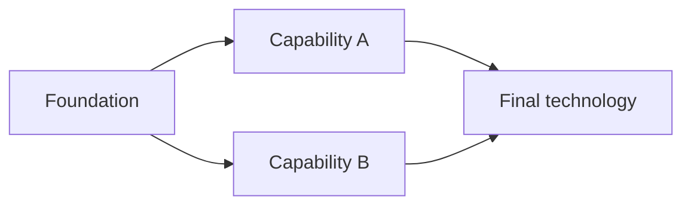

# Technology, ages, and cultures

Status: design draft. Last updated: September 30, 2026.

See [the decision register](README.md) for confirmed direction, [trade](trade-and-economy.md), [resources](strategic-resources.md), [diplomacy](diplomacy-and-alliances.md), [fortifications](fortifications-and-siege.md), and [pacing/opening](pacing-and-opening.md) for the connected designs. No gameplay implementation is included in this planning pass.

## Design intent

Technology should force choices between present capability and future development. Players should be able to build a land empire, a maritime empire, or an economy supported by either, while retaining useful reasons to invest in the third tree.

The shared framework consists of seven ages and three trees. Culture determines the available technologies, units, effects, and deliberate strengths and weaknesses within that framework. Initially, only the balanced default culture is playable.

## Current simulation and art evidence

The current Age of Fronts skirmish is the implementation target. The inherited OpenFront simulation is separate and should not acquire a parallel technology implementation during this work.

- `src/skirmish/Protocol.ts` currently defines infantry, archer, and cavalry squads; transport and warship vessels; and barracks, archery, stables, city, factory, and port buildings. Player state has no age, culture, research, or trade-route state.
- `src/skirmish/Rules.ts` centralises provisional costs and unit/building effects. Starting gold is 3,000. Land squads cost reserve troops; buildings and ships cost gold.
- `src/skirmish/Simulation.ts` validates commands and advances gameplay. It currently grants camp/territory income and passive building income. Buildings change owner when their tile is captured.
- `src/skirmish/client/SkirmishViewModel.ts` derives presentation from snapshots. The research and trade interfaces should extend that separation.
- The art contains recurring melee, ranged, cavalry, transport, warship, city, factory, port, barracks, archery, and stables icons for all seven ages.
- Additional art includes mines/siege facilities from Bronze onward, blacksmiths from Bronze through Late Medieval, an Early Modern Armory, a Modern Arms Factory, oil well/rig, military airstrip, fighter/bomber and strategic payload/silo art. Aviation and strategic weapons are confirmed Modern unlocks; their combat contracts remain to be authored.
- Land animation metadata currently exists through Early Modern; Modern land units have static art. All seven ages have ship metadata, six have land-trader metadata, and roads begin at Bronze. See the dated full art audit rather than treating the earlier snapshot as current.

These observations are source inspection, not runtime validation.

## Confirmed progression rules

- Culture is chosen once at match start.
- Technology progress resets each match.
- Research purchases spend gold and complete after a research duration.
- For each age, completing all technologies in any two of Naval, Warfare, and Economic enables advancement eligibility.
- The unfinished third tree is allowed to remain unfinished when advancing.
- The first culture starts with Flint Weapons and Settlements unlocked.
- Target about one hour for a match that goes through the full technology tree.
- Use one research queue per tree, following the accepted proposal.
- Age advancement is paid and timed: first transition 50,000 gold and 30-45 seconds, with later transitions somewhat more expensive and longer.
- Start with three melee units and no buildings, with enough cash for a city and barracks.
- Upgrade existing troops explicitly through their selected unit card on the left.
- Add strategic resources, with horses first and mine/factory/rig production as specified in the resource plan.
- Blacksmiths and arms factories consume strategic materials to produce weapons required for post-Stone troops; Stone troops are exempt and commercial cargo is separate.
- Older unlocked troop definitions remain recruitable without the current age's material, retaining their original weapon requirements.
- Mounted cavalry always costs horses; tanks require manufactured armament, steel, oil and reserves instead of horses.
- Towers, linked walls, and siege weapons in every age belong in the authored research content.

## Starting technologies

Recommended representation: the default culture explicitly lists two starting technology IDs. Match creation grants them as completed, once, without a purchase or research timer. They participate in prerequisites and tree completion like researched technologies.

| Starting technology | Tree               | Proposed capability                                                                    |
| ------------------- | ------------------ | -------------------------------------------------------------------------------------- |
| Flint Weapons       | Stone Age Warfare  | Basic infantry equipment and access to the corresponding barracks/infantry capability. |
| Settlements         | Stone Age Economic | Access to cities and their basic reserve-production capability.                        |

Starting unlocks grant construction/recruitment capabilities without creating buildings. The confirmed opening is three melee units, no buildings, and sufficient gold for a city plus barracks. Remove the prototype's automatic completed barracks and four-unit opening when implementing this setup. Starting reserve count and exact formation strength remain numerical decisions.

Under the proposed four-tech structure, Warfare starts at 1/4, Economic at 1/4, and Naval at 0/4. Completing Warfare and Economic therefore requires six additional Stone Age purchases. This is an intentional startup advantage for the default culture, not a reason to exclude granted technologies from completion.

Future cultures should specify their own starting technology sets. Do not assume every culture receives these same grants.

## Tree structure and completion

Proposed shape per tree and age:

The two branches let players choose research order. They are both required for completion; there are no mutually exclusive choices inside a tree that must be fully completed.

Completion uses the technologies in the culture's resolved tree for the specified age. Starting grants count. Research in progress does not count. Completion in an earlier age cannot satisfy the next age's requirement.

Keep all three trees independently completable. A port or army may need supporting infrastructure to operate, but requiring Economic research to finish Warfare or Naval would covertly force a third tree into the advancement rule.

Proposed catch-up rule: each later-age foundation requires completion of that tree's previous-age nodes as well as the appropriate empire age. The final technology proves completion in the usual four-node graph; Classical Warfare also requires the separate Bronze Armies node. An unfinished tree can be completed after the empire advances, but its missing tiers cannot be skipped. New-age availability does not automatically upgrade units or buildings in the unfinished tree.

## Complete authored base tree

[The complete base catalogue](base-tech-tree.md) now replaces the earlier Stone/Bronze sketches and seven-age theme roadmap. It contains every counted technology, prerequisite, cost/time proposal, exact unit/producer placement, retained older recipes, horse/cargo/road progression and the full gold budget. [The age-by-age map](base-tech-tree-map.md) plots the same catalogue. [The art audit](base-tech-tree-art-audit.md) records all nine art categories and missing content.

Four nodes per tree per age remain the usual structure, with the confirmed Bronze Armies addition as a fifth Warfare node: 85 counted technologies, two free starting grants and 83 paid purchases. Complete all five Bronze Warfare nodes for that tree to qualify. Economic owns raw extraction/refining, general production/reserves and commerce; Warfare owns equipment producers/patterns, combat definitions, armies, charges, fortifications/siege, and Modern aviation/strategic weapons; Naval owns ports and vessel/sea-transport/commerce capabilities. Building/operational dependencies are distinct from research edges.

The latest decisions settle horse ordering and tanks: Horsemanship is earliest horse access without forcing mining to depend on Warfare; tanks consume a manufactured armament item as well as steel, oil and reserves. Basic naval powder arrives in Late Medieval to match cannon-equipped ship art, with handheld infantry firearms and larger powder manufacture in Early Modern. The new Organ Gun/Bombard art is also placed in the Late Medieval powder tier as a content proposal.

The Modern Warfare draft bundles Modern Armaments, Combined Arms, Military Aviation and Strategic Weapons. Combined Arms includes marksmen/tanks/artillery, gun nests/trenches and aircraft-only anti-air vehicles. Strategic Weapons includes ICBM/hydrogen payloads and fixed/mobile MIRV launchers. Older walls remain usable; advancing does not convert them. These capability bundles stay within four counted nodes; missile defence is separate and its placement/rules are still open. [Modern rules](modern-defences-and-strategic-weapons.md) distinguish cover, aircraft targeting, launchers and payloads; art availability does not establish their combat or production balance.

The artwork goes directly from Early Modern to Modern; this plan introduces no eighth Industrial Age. Troops/ships retain their actual authored definitions after empire advancement. Existing troops refit explicitly from the left card and reset promotion to recruit on successful refit. [Combat and promotion rules](combat-and-promotions.md) define the new stats/charge direction.

## Research and advancement proposals

The one-queue-per-tree concurrency model is accepted. Propose a single active job per queue initially; queue length, cancellation, and refunds remain open.

- Validate age, culture availability, prerequisites, completion, queue state, and funds in the domain before atomically starting research and spending gold.
- Advance jobs on simulation ticks. Rendering, animation, and wall-clock callbacks cannot grant technologies.
- Completing two trees enables the confirmed paid, timed Advance Age action.
- The first age fee is 50,000 gold and its timer must be within 30-45 seconds. The pacing plan proposes 40 seconds initially, later costs up to 330,000, and timers increasing by five seconds per transition.
- The empire age makes its research available; it does not grant those technologies or refit existing units automatically.
- A job retains its authored age during empire advancement. Finishing an old-age job cannot count toward the next-age tree.
- The third tree remains available subject to its earlier prerequisites.

Technology research belongs to player progression, rather than whichever building was clicked. Capturing an enemy building does not grant the previous owner's research.

A strategic resource production bottleneck can constrain deployment without changing the research completion condition. Review this carefully: Economic production must not become a hidden mandatory third completed tree to advance.

## Culture design

Use a shared framework with declarative culture differences. A culture can replace technologies and unit definitions, adjust selected costs/effects, or deliberately alter prerequisites within a valid tree. Avoid copying the whole default tree or scattering culture-name checks through gameplay code.

Each culture should preserve the default counted workload: four slots in each tree except five in Bronze Warfare, including an Armies-equivalent organizational capability. Replacement technologies have their own stable IDs and explicit resolved prerequisites. Slot identity is a progression-balancing aid, not a hard-coded technology name. Use the authored set of nodes when checking completion; do not hard-code four research purchases.

Deleting a technology must not accidentally shorten a culture's advancement workload. Adding a required unique technology must not accidentally lengthen it. Deliberate starting grants or gold/time discounts are allowed design advantages and need to be budgeted accordingly.

| Culture concept | Proposed identity                                               | Possible unique technologies                                      | Tradeoff to design                               |
| --------------- | --------------------------------------------------------------- | ----------------------------------------------------------------- | ------------------------------------------------ |
| Default         | Balanced capabilities; Flint Weapons and Settlements at startup | Standard research content                                         | No exceptional specialisation                    |
| Italians        | Commerce, naval logistics, specialist ranged forces             | Merchant networks, arsenal production, contracted forces          | Weaker heavy-armour or mass-mobilisation options |
| Americans       | Industry, mobilisation, modern combined arms                    | Standardised production, mechanised logistics, precision doctrine | Expensive advanced forces and infrastructure     |

These identities are gameplay proposals, not researched historical specifications. The chosen culture persists through all seven ages; use shared early foundations and increasingly distinctive later content. No claim of historical American statehood in the Stone Age is intended.

Reference reviewed for the initial discussion: [Age of Empires II civilization and technology-tree guide](https://www.ageofempires.com/learn-to-play/civilizations-game-modes-aoe2/). Its shared unit classes with civilization-specific upgrades are a useful precedent, not a prescribed implementation.

## Unit, building, and presentation definitions

Do not model ages as sprite swaps on the current three squad classes. Modern cavalry art depicts tanks; later infantry art depicts firearms; the Modern ranged art depicts precision shooters. Equipment, attack range, target rules, movement, durability, and resource costs must be explicit.

Separate unit line identity from a particular age/culture unit definition. Lines describe development; definitions specify gameplay. A civilian trader is neither a combat squad nor a military transport merely because it shares movement code.

Use era-appropriate building names: the Stone Age factory art is a craft workshop; later versions can be manufactories or industrial factories. Shared production behaviour does not require exposing internal generic type names to players.

Existing troops require an explicit upgrade action in the selected unit card on the left. Research grants eligibility; it does not automatically refit existing formations. The card presents the researched target, its agreed gold/equipment/horse requirements, and unavailable reason. Post-Stone troop recruitment requires produced weapons, while Stone troop recipes are exempt. Tanks additionally require manufactured armament, steel, oil and reserves. Equipment quantities for refitting an existing unit still need agreement; successful age refits reset promotion to recruit. Exact refit duration, location, movement/combat restrictions, cancellation, and health/order preservation are open; see the pacing/opening plan. New recruits use an explicitly chosen unlocked definition, including retained older-age choices. Validate the selected definition's recipe instead of replacing its costs with the current empire age's material requirements.

## MVVM and domain boundaries

This design requires no departure from MVVM or Domain-Driven Design.

- **Progression domain:** culture choice, starting grants, completed technology, research jobs, and advancement eligibility/state.
- **Economy domain:** authoritative gold and resource ledgers plus validated spending/income transactions. Research, recruitment, construction, refits, and trade use consistent ownership and accounting.
- **Resource/production domain:** map nodes, extraction, horse breeding, refining, blacksmith/arms-factory weapon jobs, and commercial goods batches. Track strategic materials, finished equipment, and commercial shipments separately, with conserved recipe inputs/outputs.
- **Trade domain:** routes, trader assignments, cargo/delivery state, and payout eligibility. Detailed responsibilities are in the trade plan.
- **Diplomacy domain:** alliance offers, treaties, expiry/renewal, betrayal status, and relationship policies for combat, capture, and trade categories.
- **Fortification domain:** towers, links, integrity, construction/breaches, gates, and authoritative dynamic navigation/capture barriers.
- **Unit/building capability definitions:** resolve the selected culture and researched technology into allowed recruitment/construction and effective rules.
- **Application commands:** carry requests into the domain. Human UI and AI use the same validation and effects.
- **ViewModels:** derive tree progress, purchase eligibility, reasons for rejection, timers, unlocked content, and effective statistics from snapshots/domain read models.
- **Views and artwork:** draw state and animation; they do not spend gold, grant capabilities, move traders, or settle deliveries.

These are responsibility boundaries, not a requirement for separate processes or an extensive service framework. Do not grow `Simulation.ts` into a collection of culture-specific conditionals.

Technology/culture definitions should be validated for unique IDs, resolvable prerequisites, acyclic graphs, legal age references, satisfiable completion, valid starting grants, and valid effects. Resolve and pin a ruleset for each match; later multiplayer/replay work must preserve its identity and deterministic state.

## Diplomacy and progression

Recommend offering alliances from match start for every culture. Basic diplomacy should not require Economic completion or an additional fourth tree. Any later technology that improves diplomacy must fit the existing three-tree framework and have an explicit effect; no such modifier is required for the initial content set.

Allied players retain independent culture, age, gold, resources, research, buildings, recruitment, and replenishment. Acceptance does not grant the other player's unlocked units or stocks. Foreign trade is now required, and allied endpoints earn the higher commercial modifier; this is commerce, not shared control or technology.

## Balance and validation gates

The full-tree target is about one hour. The first age fee is 50K and the opening guarantees enough cash for a city/barracks. Use the pacing plan's proposed arrival/cost table as the starting budget, not a tested result.

Construction, research, reserve growth, strategic refining, weapon-dependent recruitment, manual troop upgrades, factory goods, foreign/allied delivery, trader capture, and walls/siege must share one coherent economy. Current prototype prices/incomes cannot be retained by default against the new 50K fee.

Trader generation is free but output, cargo, active actors, and replacement are bounded. Early horses depend on contested nodes; later stable production increases. Cavalry horse costs must remain meaningful.

Evaluate whether Economic becomes compulsory in practice and whether allied trade accelerates the intended hour beyond recognition. Validate material access and late oil without granting new tiers invisibly on age advancement.

Implementation checks must cover startup grants and the building-free three-melee opening, exactly-once spending, research/advancement timers, every choice of two trees, catch-up prerequisites, culture substitutions, left-card upgrades, resource costs/production, Stone weapon exemption, older-tier recruitment during newer-material shortages, mounted horse costs, tank steel/oil costs, deliveries/capture, linked barriers/gates, betrayal, and AI parity. Static checks do not establish playtest balance.
