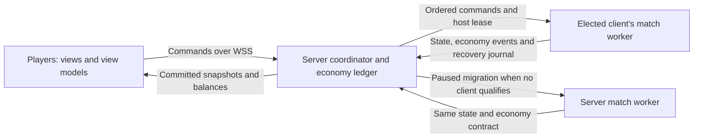

# Multiplayer plan for Age of Fronts

Revised October 1, 2026: use one elected client to execute each match, with a
server coordinator, server-owned gold/reserve ledgers, paused host migration,
and a server simulation as fallback. This replaces the earlier recommendation
to run every match on a dedicated server.

This is appropriate for casual games between friends. The user explicitly accepts
the additional cheating exposure and chose lightweight economy checks that trust
host-reported world events. It is not a competitive anti-cheat architecture.
Host migration, checkpoint recovery, and fallback capacity are required features,
not optional polish. DDD and MVVM remain the architecture.

This document is a plan, not an implemented or validated multiplayer system.
The published Static Site currently starts a local AI match.

## Confirmed requirements and trust policy

| Requirement | Confirmed behavior |
| ----------- | ------------------ |
| Maps | Mediterranean and Africa |
| Default lobby mode | Free for all |
| Default total faction slots | 20; AI fills unused human seats when the roster freezes |
| Default minimum humans before starting | 2 |
| Default lobby countdown | 60 seconds |
| Main lobby page | Up to three featured map cards rotating every 60 seconds beside at most three listed custom lobbies |
| Extra custom lobbies | Optional waiting queue for a directory display space |
| Custom room settings | Map, slots up to the current 20-faction cap, minimum humans, timer, AI filling, map size, technology speed and resource density/output |
| Custom diplomacy and victory | In-match alliances allowed/disabled and solo/allied conquest; no fixed teams in this pass |
| Empire customization | Empire name plus a flag from OpenFront's local unrestricted catalog |
| Start trigger | Human lobby fills or countdown expires |
| Normal execution | One suitable connected client hosts the whole simulation |
| Host disconnect | Pause the match, then select a replacement client |
| No valid client host | Resume the same match on the server |
| Economy checks | Server owns gold/reserve balances; rejects direct edits and unpaid spending |
| Economy evidence | Trust host world events; verify their accounting and basic consistency |
| Intended audience | Casual play with friends; broader cheating resistance is outside this release |

In the default preset, two humans start with 18 AI; 20 humans start with no AI
replacements. Custom rooms can reduce capacity and disable AI vacancy filling.
Optional tribes must not silently exceed the configured faction budget, capped
at 20. Training Square remains a local development map outside this directory.

The intended flow is pick a map, join its lobby, wait for the roster/countdown,
load the agreed match, and play. Host election and recovery are server decisions,
projected into the interface.

## Main page, custom directory and empire identity

The user chose a working local preview before connection work. The homepage is
a lobby holder featuring Mediterranean and Africa for the first map review,
three custom display spaces, a Create lobby dialog, a waiting queue, and
an empire customization bar. See [LobbyPagePlan.md](LobbyPagePlan.md) for the
implemented frontend and its verification checklist. Browser-saved preview rooms,
sample seats and timers do not represent shared online sessions.

Implement the following connection work in the coordinator bounded context:

- Publish the featured-map pool, rotation epoch and 60-second schedule in the
  directory projection so browsers show consistent rotations. Show up to three
  cards. Rotation changes discoverability, never destroys an entered room,
  ejects players, restarts its countdown or interrupts its running match. Keep
  room lifecycle and stable room IDs independent of the featured-card rotation.
  Custom listings/queue retain their existing admission and promotion rules.
  All approved maps remain available for custom creation and the AI selector.

- A directory projection identifies default rooms, listed custom rooms, pending
  custom listings, their safe owner/name/flag metadata, immutable rules, actual
  human occupancy, and server countdown/start/loading state. Publish a revisioned
  snapshot plus ordered updates; support resync after missed events.
- Create/cancel/join/leave are session-bound commands with idempotency keys and
  acknowledgements. The server generates room IDs and owns owner permissions.
  Creating twice after a retry must not occupy a second space or queue position.
- Keep at most three custom rooms **listed** at a time. This is a directory
  display limit, not a promise that only three matches can exist or a substitute
  for measured match/fallback capacity. The preview uses an opt-in FIFO queue;
  finalize the production fairness policy before implementation.
- Queue insertion, cancellation, listing release and promotion must commit
  atomically. Preserve the original server queue order after reconnect/restart.
  Cancelled/expired entries must not be promoted. Simultaneous creators or
  closers must not claim the same display space.
- Define when a listing is released: owner closes, room expires, or its match
  begins. Keep the running match separate from its directory listing. A lobby
  owner leaving before start needs a documented ownership/expiry policy.
- Add per-session creation limits, rate limits and listing leases. With no owner
  limit or expiry, one person can hold all three custom spaces forever. Recommended
  starting policy: one active custom room per owner and a bounded disconnected
  listing lease; these thresholds are still decisions, not approved rules.
- Decide whether an unlisted queued room may admit invited friends. Listing queue
  position and actual room admission are separate concerns. The local preview
  lets the owner review queued room settings without putting it in the holder.
- Validate configurable rules on the server: 2–20 slots, minimum humans within
  capacity, the preview's 15–300 second timer range, AI policy, supported map/size/
  technology speed, resource density/output presets and diplomacy/victory compatibility. Finalize range policy
  before production. Allied conquest requires permitted alliances. Enforce these
  rules in the gameplay domain and command ingress, not only in the form.
- Freeze all settings into the match manifest before loading. Human+AI counts
  use the configured capacity, not an unconditional 20. Host qualification and
  fallback reservation must account for the chosen settings and workload.
- Bind a validated display name and an allowed flag identifier to server faction
  identity. Names and flags are presentation metadata, never authentication or
  ownership. Render names as text and resolve flags through the allowlisted local
  catalog. The preview uses the same unrestricted country/historical flags as
  OpenFront's inventory and does not grant paid/account cosmetics.
- Show pending create/join/cancel, rejected settings, stale directory revisions,
  queue position/promotion, reconnect and expired-room states through a session
  application port and online ViewModel. Replace the local preview adapter only
  when those actions work across browsers. Keep DDD and MVVM boundaries intact.

Default world size, temporary alliance policy and exact countdown reset semantics
still need production decisions. The current preview demonstrates a 500-cell longest edge,
alliance-disabled solo conquest, countdown at the minimum, and reset below it.

Map resolution uses 250/500/1000 as the longest edge and preserves source aspect
ratio. Actual cell counts vary: a 1000×1000 Africa map has twice as many cells
as 1000×500 Mediterranean. Host eligibility, snapshot budgets and fallback
reservations must use actual dimensions and faction count, not size labels.
Freeze each map's content revision, source/calibration and environment revision
in the match manifest. See [MapReview.md](MapReview.md) for the gated map rollout.

### Resource placement and output

Custom rooms expose two independently selected multipliers, each offering 1×,
2×, 3× or 5×. Default rooms use 1× for both. The local preview persists/displays
these values; playable matches do not yet consume them.

- Resource density changes the target number of natural deposit locations.
  Deposit output changes the extraction yield from each location. Use the same
  values for every faction. Do not multiply refinery/manufacturing recipes again
  or bypass age discovery, research, ownership or building requirements.
- Validate both fields at coordinator ingress and freeze them with the map seed,
  map/content revision and generator version in the match manifest. The host
  must not change them mid-match. Include the rules and actual deposit state in
  checkpoints so migration/fallback cannot regenerate a different economy.
- The current `Supply` generator uses a seeded per-tile hash with a fixed
  placement rate. Move configurable placement/yield into shared domain rules
  consumed by both browser and server runners. Preserve the existing 1× seeded
  baseline, unique eligible deposit tiles, terrain restrictions and small-map
  guarantees. Keep placement deterministic; never add a client-side random pass.
- Define density as a target rate relative to the baseline, bounded by eligible
  terrain. Do not promise an exact multiplier of deposits on every small map.
  Prove determinism, legal/unique placement, unchanged 1× behavior, and yield
  scaling exactly once at all four presets. Increasing density must not delete
  baseline deposits for the same seed.
- Benchmark 5× density at the largest supported map and full faction capacity.
  More nodes affect extraction lookups, rendering, snapshots and checkpoints;
  include this workload in client host eligibility and server fallback capacity.
  Both controls at 5× target roughly 25× potential raw production, not merely 5×.

Server economy checks still use the agreed lightweight ledger and trusted host
world events. Resource settings do not authorize direct gold/reserve edits or
unpaid purchases. The manifest and checkpoint must explain the selected rules
without claiming that the coordinator independently proves all world income.

## Execution and ownership

Keep the frontend at `www.ageoffronts.com` on the existing Render Static Site.
Add a separate Web Service for the coordinator, relay, economy verification,
checkpoint storage, and fallback workers.

The elected client's browser runs `Skirmish` in a dedicated Web Worker. It owns
movement, pathfinding, AI, combat, capture, construction, research, and victory
for that match. Other clients receive snapshots and submit commands; they do
not each run a full active simulation. The host's own presentation uses the same
network command path and committed results as everyone else.

The coordinator owns membership, faction identity, command ingress and ordering,
the authoritative host assignment, economy ledgers, and recoverable commit
boundaries. It relays accepted state; it does not rerun movement/combat on every
tick during ordinary client hosting.

The fallback Node worker executes the same gameplay domain and checkpoint format.
Only one executor may publish accepted gameplay state for a match at a time.
Do not distribute separate AI factions, movement, or combat among multiple clients.

Recommended first transport: all browsers connect to the coordinator over WSS.
The host uploads each snapshot once; the relay fans it out. This removes normal
server simulation work, but retains server bandwidth and a network hop. It is
not a promise of lower latency or lower total hosting cost.

Direct WebRTC host-to-player links are a later optimization, only if relay
measurements justify them. They require signaling, connectivity checks and
STUN/TURN relay support. Do not make direct connectivity a prerequisite for
playing or assume it removes relay costs.

## DDD and MVVM boundaries

| Layer | Responsibility |
| ----- | -------------- |
| Lobby domain | Seats, admission, countdown, frozen roster and start eligibility |
| Host-assignment domain | Executor identity, host epoch, lease, pause/migration/resume transitions |
| Match domain | Existing simulation rules, commands, AI and world state |
| Economy domain | Shared income/cost rules, gold/reserve ledgers and exactly-once transactions |
| Application | Host selection, tick/commit orchestration, checkpoint recovery and fallback admission |
| Infrastructure | WSS relay, clocks, browser/Node workers, codecs, durable storage and metrics |
| View models | Local faction, lobby, balances, connection, hosting and migration state |
| Views | Render projections and dispatch user actions |

Moving the executor between browser and server is an infrastructure/application
change. Keep gameplay rules in the domain. Extract shared economy transitions
from the current domain where needed; do not copy formulas into socket handlers
or implement a second, diverging economy in the coordinator.

The host assignment and economy ledger have different responsibilities, but
commit together at one match boundary. A snapshot must not describe a purchase
whose ledger transaction was rejected, or a ledger charge whose world action
was rejected. Server balances are domain inputs/results, not a cosmetic HUD
correction.

Introduce an execution port for local, client-hosted, and server-fallback runners,
plus a transport port for presentation. Views and view models must not elect a
host, grant currency, advance the match clock, or authorize recovery.

## Existing code and required foundations

- `Simulation.ts` already owns `Skirmish.applyCommand` and `Skirmish.step`.
  Reuse it in browser and Node runners rather than rewriting gameplay.
- `worker.ts` already provides a browser simulation adapter targeting 20 ticks
  per second. Hosting needs a separate lifecycle, lease and network adapter.
- `SnapshotCodec.ts` is a presentation codec. Its packets omit internal
  simulation state and are not sufficient to resume a match.
- `PseudoRandom.getState()` and `fromState()` provide RNG state primitives.
  Include every gameplay RNG stream in recovery; the initial seed is insufficient.
- The current roster and presentation assume one human, often `playerId === 1`.
  Introduce an explicit human/AI roster and session-bound `localPlayerId`.
  Preserve identity through nested view models, selection, groups and rendering.
- The inherited OpenFront server does not execute `Skirmish`. Its lobby/ingress
  concepts may inform adapters; `start:server` does not implement this design.

## Lobby, manifest and initial host selection

Keep admission and countdown on the server. Serialize join/start transitions so
simultaneous arrivals cannot take the same twentieth seat or start twice. Bind a
server-issued session/resume credential to one participant and faction. Duplicate
tabs must not create extra seats or host identities.

Recommended countdown semantics, still to confirm: start when the second human
joins, reset if the human count falls below two before roster freeze, and freeze
immediately at 20 humans. The duration/minimum are confirmed; these details are
proposals.

Freeze one manifest containing match ID, build/protocol/checkpoint/ruleset versions,
map/content hashes, seed, world size, roster, factions, and mode. The server fixes
these values. Every executor must load the matching canonical assets.

Make hosting eligibility opt-in and explain that the selected player runs the
match while playing. Proposed qualification criteria:

- Correct build/content, initialized worker and successful checkpoint round trip.
- A representative benchmark for the selected map and 20-faction workload.
  Measure simulation plus checkpoint/encoding cost while rendering the host's game.
- Stable coordinator connection, measured RTT/jitter and adequate upload capacity.
- Available CPU/memory headroom and no sustained worker stalls.
- Willingness to remain connected and support the pause/recovery protocol.

The coordinator ranks qualifying clients, uses a stable tie-breaker, and retains
a healthy host rather than repeatedly chasing minor score changes. In the first
relay transport, measure the host's connection to the coordinator. If direct
links are added, measure connectivity to all players as well.

Client benchmark reports are useful for selecting a host, not proof of honesty.
Observe actual tick/queue performance after selection. Exact benchmark thresholds,
timeouts and overload triggers must be established by tests, not hardware names.

If no client qualifies before the first tick, allocate fallback capacity and use
the server runner. Finish the loading/readiness barrier before beginning gameplay.
Do not start a match that cannot satisfy the agreed fallback-capacity policy.

## Commands, ticks and committed state

All human commands, including the host player's, go through authenticated
coordinator ingress. The session supplies the faction. Validate schema, sizes,
numeric bounds, phase, command rate and receipt identity. The runner validates
world-dependent ownership and gameplay preconditions. The server may cross-check
against its accepted state projection without simulating movement.

The coordinator assigns stable command IDs/order and application tick. The host
cannot invent another human's command receipt. AI decisions originate from the
current executor and must be distinguishable from human input. Recovery must
either regenerate those decisions deterministically or replay their recorded
decisions, never do both. Select and prove one replay contract.

Every state/commit message carries match ID, host epoch, tick, command cursor,
snapshot/baseline sequence and economy-ledger version. The coordinator accepts
messages only from the current executor with a valid lease. Enforce contiguous
progress, bounded lookahead and a maximum tick-advance rate; host clock changes
must not create additional income intervals.

Maintain 20 simulation ticks per second. Snapshot, checkpoint and durable-write
frequencies are separate measured settings. Batch acknowledgements and pipeline
bounded work so the worker does not synchronously await a network round trip
inside each tick. Clients interpolate committed snapshots.

Use an explicit commit protocol: a batch proposes world results, economy
transactions and recovery data; the coordinator validates/stages them, persists
the recoverable boundary, then publishes the accepted state and acknowledgements.
Reject the batch atomically on inconsistency. Do not let in-memory partial ledger
updates survive a rejected batch.

Distinguish command received, applied and rejected. A received order is not proof
that it changed the world or spent resources. Stable IDs survive host migration
and reconnect, so replay/retry cannot charge twice.

Recommended policy: gameplay shown as authoritative must be recoverable from a
stored checkpoint plus a committed journal. If speculative presentation is used,
label its reconciliation behavior and bound its distance from that boundary.
Silent rollback of accepted purchases or hidden progress loss is not an acceptable
substitute for recovery.

Remove unilateral restart, speed and manual pause controls from online matches.
The coordinator's recovery pause is mandatory; local AI mode retains local controls.

## Server checks for gold and reserves

The confirmed protection is a lightweight, server-owned ledger that trusts the
host's world events. It prevents direct authoritative balance edits and unpaid
spending within the accepted protocol. It does not independently prove all income
sources or make a modified host unable to cheat.

Initialize every faction's gold/reserves on the server from the frozen ruleset.
Human clients submit actions, never balances, arbitrary grants or costs. The host
submits typed outcomes/events; the server calculates their permitted ledger
effects using shared economy rules. Apply the same checks to human and AI factions.

For each committed transaction:

1. Require match, stable event/command ID, faction, tick and current host epoch.
   Authenticate human requests independently of host claims.
2. Derive costs from content and accepted action details; do not accept a quoted
   price from a client. Reject overspending and reserve overdrafts.
3. Account for all gold/reserve paths: income, recruitment, replenishment,
   buildings/walls, ships, research, age advancement, upgrades, strategic weapons,
   trade proceeds, and any refunds/transfers the rules actually support.
4. For income, derive amounts from accepted territory, completed buildings, age,
   trade records and the exact current simulation mode. Check interval timing,
   completion timers, map/population bounds and event prerequisites.
5. Reject duplicate income periods, reused trade/delivery receipts, duplicated
   command outcomes, unknown grant types, non-finite values and invalid counts.
   Enforce the ruleset's reserve limits; do not invent a gold cap.
6. Stage a purchase with its world outcome. If the action fails its domain
   preconditions, neither charge nor publish a successful purchase. If funds are
   reserved pending execution, bound/expire the reservation and release it once.
7. Require host checkpoint balances to match the server ledger at the same tick
   and cursor. Publish server-approved balances and outcomes to every participant.

Current economy code is spread across `produceReserves` in `Simulation.ts`,
`BuildingIndex.ts`, and expansion services such as `Supply.ts`, `Progression.ts`
and `Trade.ts`. Audit those mutation paths before extracting shared transitions.
The expanded and base modes have different reserve/income behavior; do not hard-code
one remembered formula into multiplayer checks.

Freeze on an economy/checkpoint mismatch, reject the inconsistent batch, and
recover from the last accepted boundary. A cosmetic correction of the snapshot
would leave the runner's gameplay state inconsistent. Repeated invalid events
disqualify that host; select a replacement or use fallback. Keep this separate
from automatic account bans, which are outside the requested scope.

**Accepted limitation:** land captures, combat outcomes and trade deliveries are
host-produced evidence. A malicious host can fabricate plausible world events
that lead to apparently legitimate income. The chosen ledger cannot prove these
events happened. Hashes, signatures and nonnegative-number checks do not solve
that trust problem. Preventing this as well would require independently verifying
the relevant world transitions, potentially rerunning substantial simulation.
The user chose to accept this limitation for games with friends.

The ledger protects accepted shared state. It cannot stop someone changing the
gold number displayed in their own modified browser.

## Complete checkpoints and recovery journal

Introduce a versioned domain checkpoint separate from presentation snapshots.
Export/import at an atomic fixed-tick boundary without modifying the live domain.
Store enough state to continue, not merely redraw the scene:

- Full roster/options, manifest hashes, tick and entity/event ID counters.
- Terrain ownership, claims/progress, units, buildings, ships and construction.
- Orders, navigation progress, queued route jobs, formations, boarding and combat.
- AI state, all RNG streams, timers and scheduled decisions.
- Expansion inventories, progression, production jobs, diplomacy, roads,
  fortifications, trade/cargo actors, aircraft, projectiles and victory state.
- Applied command/event cursor and corresponding economy-ledger version.

Distinguish derived caches that can be rebuilt from state that must be persisted.
Rebuilding indexes must preserve future results and ordering. Prove restore/continue
equivalence in a fresh browser worker and in Node.

Store accepted checkpoints on the server before acknowledging them as recovery
bases. Retain a previous valid checkpoint and a bounded ordered journal for the
suffix through the latest committed boundary. Compaction must be atomic; never
discard the only recovery path before the replacement is durable.

A checksum detects corruption or version mismatch, not dishonest world state.
Validate payload size, schema, map dimensions, IDs and cross-field consistency,
and compare economy fields with the server ledger. Remaining gameplay honesty
follows the explicitly accepted host trust policy.

Recovered execution must replay the suffix to the committed tick without generating
extra AI decisions, income or charges. No continuously running full server shadow
simulation is required in normal client mode; short recovery replay is work the
replacement runner performs while the match is paused.

Checkpoint frequency, maximum suffix length and storage throughput must be
benchmarked. If deterministic suffix replay cannot be proven, the fallback
checkpoint/commit design must change before implementation is called complete;
a presentation snapshot or an undocumented rollback cannot replace it.

## Pause, elect, restore and resume

The coordinator owns the state machine:
`loading -> running -> paused -> electing -> restoring -> resuming -> running`.
Record whether the active executor is a client or server. Finished/cancelled
matches cannot be restarted by a delayed reconnect.

On host socket loss, lease expiry or a confirmed worker stall:

1. **Freeze acceptance.** Stop accepting new host commits and broadcast the pause
   reason and last committed tick/cursor. Disable gameplay orders. No AI, movement,
   production, research, construction or income advances during the pause.
2. **Fence the old host.** Increment the host epoch/revoke its lease before granting
   another executor. Late snapshots, AI orders and economy events from the old
   epoch are rejected even if that browser is still running.
3. **Select a candidate.** Rank connected, compatible and currently qualifying
   clients. If a candidate declines, times out or fails restoration, try the next
   within a bounded election window.
4. **Use server fallback if none qualifies.** Allocate a reserved Node worker,
   restore the same checkpoint and replay the same committed suffix. Do not
   reinitialize the map, seed, factions or balances.
5. **Prepare resume.** The replacement acknowledges its restored tick, state
   digest and ledger version. Send all clients a fresh full snapshot/baseline,
   new epoch and connection state, followed by a bounded readiness barrier.
6. **Resume once.** The coordinator publishes the resume boundary. Continue at
   the next fixed tick. Do not convert elapsed wall-clock downtime into catch-up
   income or gameplay steps.

Pause detection has a finite timeout. Before receiving the notice, clients may
hold/interpolate only within a bounded freshness window; they must not invent
authoritative advancement. An exact instantaneous pause at remote disconnect is
not technically achievable.

Proposed pause input policy: reject new gameplay commands with an explicit
paused/retry response. Preserve outcomes for already committed commands and
idempotently reconcile received-but-uncommitted requests after restoration.
Do not silently queue an unbounded burst or apply an old order twice.

The former host returns as a normal participant with its existing faction.
It cannot reclaim the match automatically. Recommended stability policy: after
server fallback succeeds, retain it for that match instead of repeatedly switching
back to a slightly faster client.

A participant disconnect is separate from host replacement. It must not create
another faction, reset a match, or implicitly forfeit the player. Guest/account
identity, disconnect grace and AI takeover remain choices to settle.

## Fallback capacity and coordinator failure

Fallback runs the actual domain in a Node worker thread or isolated process,
away from lobby HTTP and heartbeat handling. A lightweight relay alone cannot
serve as fallback.

Reserve a measured fallback budget for admitted matches. Several client hosts
can disappear together; size the budget against that scenario. Prefer refusing
additional starts when the agreed fallback guarantee cannot be met over claiming
unlimited capacity. Decide the permitted simultaneous-fallback count before launch.

If fallback capacity is unexpectedly unavailable, remain paused with a visible
reason and bounded recovery attempts. A timeout/cancellation policy still needs
agreement. Never silently resume on an underpowered host, slow the tick rate,
drop AI factions, or restart the game.

Coordinator failure is different from client host failure. While the coordinator
is unreachable, clients must stop on lease expiry; they do not self-elect a new
authority. Recover its host assignment, economy ledger, checkpoint and journal
durably before issuing a new epoch. Do not resume a saved world against a different
tick's balances. Recovery after coordinator deploy/restart is an explicit feature
requiring tests, not something ordinary socket reconnect provides.

## Network, hosting and performance

Use versioned HTTPS/WSS contracts. Define binary framing, reset snapshots, per-client
baselines, bounded command/commit/checkpoint queues and backpressure. A slow viewer
must not stall the host or retain unlimited history. After discarding a delta,
establish a new valid baseline.

Serve HTTP and WebSocket upgrades on the same Render port, listening on
`0.0.0.0` and honoring `PORT`. An approved subdomain such as `play.ageoffronts.com`
can host the coordinator; the actual hostname remains to be chosen.

Render's free Web Services can spin down after idle periods and can restart.
For friends' trials, free hosting is an option if its interruptions and wake-up
delay are accepted. A continuously available coordinator is preferable for reliable
pause/fallback behavior. Select compute from fallback and relay measurements;
client hosting does not justify assuming the smallest server can run every fallback.

Initially use one coordinator with explicit match admission. Additional instances
need a shared directory and a single fenced owner for each match; new/reconnecting
WebSocket connections are not guaranteed to reach the same Render instance.

Measure separately: host tick CPU, rendering contention, snapshot/checkpoint
encoding, relay bandwidth, durable commits, ledger checks, pause duration,
restore/replay time, and fallback CPU/memory. At 20 ticks/second, the simulation
budget is 50 ms per tick, with operating headroom. Worker isolation keeps jobs
off the UI/event loop; it does not eliminate CPU cost.

The repository records full-population trials with 4,000 squads, 1,280 ships and
2,000 buildings that miss the 20-tick target, particularly at 1000 × 500.
This is prior evidence, not a benchmark of the new architecture. Hosting merely
moves that workload. Keep 500 × 250 as the proposed starting size and profile dense
movement before claiming full-population smoothness.

Benchmark 2 humans plus 18 AI, mixed rosters and 20 humans on all three maps.
Test a host that is also rendering a busy match, poor upload/jitter, and sustained
late-game load. Establish client qualification and fallback concurrency from results.
Do not change gameplay caps or simulation speed without an explicit decision.

## Implementation sequence and acceptance evidence

1. **Identity and execution boundaries.** Retain local AI play; add explicit
   faction identity, roster, execution/transport ports and shared economy rules.
2. **Recovery format first.** Implement complete checkpoint/restore and bounded
   journal replay; prove browser-to-browser and browser-to-Node continuation.
3. **Coordinator and ledger.** Implement host epochs/leases, ordered ingress,
   transactional economy checking and recoverable commit publication.
4. **Two-human hosted match.** One client worker hosts; both clients submit through
   the coordinator and render consistent committed state.
5. **Host migration and fallback.** Kill/disconnect the host, pause, restore on
   another client, then repeat with no eligible client and resume on Node.
6. **Connect the lobby and MVVM interface.** Connect the completed local lobby
   holder/customizer to shared directory sessions, custom-room creation, the
   three-space listing queue, real rosters/countdowns and manifest validation.
   Add eligibility/hosting notices, pause/reconnect states and the configured
   frozen human/AI roster.
7. **Capacity and hosting.** Validate 20 factions, simultaneous host losses,
   fallback admission, coordinator restart, deploy recovery and long matches.
   Then run a limited playtest with friends.

| Scenario | Required evidence |
| -------- | ----------------- |
| Direct balance edit or altered price | Rejected; shared gold/reserves do not change |
| Duplicate income, trade, purchase or retry | One ledger effect; stable acknowledgement |
| Rejected world action | No committed charge or successful world effect |
| Malformed/negative/non-finite economy data | Rejected without partial state changes |
| Host loss during purchase or income | Recovery preserves one consistent world/ledger boundary |
| Partitioned old host returns | Old epoch cannot publish or charge; no two accepted executors |
| Replacement fails or times out | Next candidate tried, then same-match server fallback |
| No client qualifies at start | Server runner used if fallback capacity permits admission |
| All clients remain weak / concurrent host losses | Measured fallback budget; visible pause if exhausted |
| Restore across browsers and Node | Same continued domain results and balances |
| Slow viewer / stale delta / duplicate tab | Bounded queues, full resync and original faction |
| Coordinator restart or deployment | Durable epoch/ledger/checkpoint recovery before resume |
| Lobby races | Exactly one start, at most 20 slots, agreed minimum humans |
| Directory races and retries | At most three custom listings; one creation/promotion effect; stable queue order |
| Queue cancellation, owner loss and restart | No ghost listing or duplicate promotion; expiry and reconnect policy applied |
| Custom rules and empire metadata | Invalid combinations, unsafe flag IDs and forged ownership rejected; escaped names |

Also test wrong build/content, checkpoint corruption, repeated invalid hosts,
worker stalls, out-of-order messages, lease expiry, lost acknowledgements,
pause-time income suppression, and elimination/victory during recovery.
Trusting host world events remains an accepted limitation, not a failed test
that these checks claim to solve.

## Shore transport recovery contract

The local domain now includes automatic shore voyages and Africa's baked major
river hydrology. Content identity must cover the new river source/width revision,
transport research/capacity rules and terrain outputs. Recovery checkpoints must
preserve temporary vessel phase, pending boarding squad IDs, final land target,
remaining voyage route, cargo and queued onward orders. UI snapshots intentionally
omit internal routes and queues and cannot substitute for those checkpoints.
The lightweight ledger should treat an unlocked automatic shore voyage as a free
vessel event, enforce its researched capacity and verify embark/sink/unload troop
conservation. It must distinguish temporary transports from paid permanent ships
and never accept a temporary vessel being converted into a reusable free navy.

## Decisions still needed before implementation

Confirmed above: client hosting, pause/election, server fallback, and lightweight
server ledgers trusting host world events. The following remain proposals/open:

- Countdown reset/start semantics, initial world size and loading timeout.
- Host eligibility thresholds/consent UI, heartbeat/lease timeout and election window.
- Checkpoint/commit cadence, journal/replay contract and maximum recovery duration.
- Fallback reservation/concurrency policy and behavior if recovery capacity is exhausted.
- Disconnect grace/AI takeover, paused-command policy and minimum humans after start.
- Guest sessions versus accounts, invitation/access controls, mid-match admission,
  default-room temporary alliances, results persistence and coordinator-restart recovery target.
- Custom listing fairness, per-owner limits, expiry/release policy, queued-room
  admission, production configuration ranges and duplicate default-room behavior.

Do not silently turn proposed timing values or policies into approved requirements.

## References

- [Current domain architecture and recorded limits](AgeOfFrontsSkirmish.md)
- [Existing static deployment](RenderDeployment.md)
- [Render WebSockets and routing](https://render.com/docs/websocket)
- [Render free-service behavior](https://render.com/docs/free)
- [Render port binding](https://render.com/docs/web-services#port-binding)
- [Microsoft discussion of player hosting and its tradeoffs](https://learn.microsoft.com/en-us/xbox/playfab/multiplayer/mpintro)
- [WebRTC TURN relay requirements](https://webrtc.org/getting-started/turn-server)
